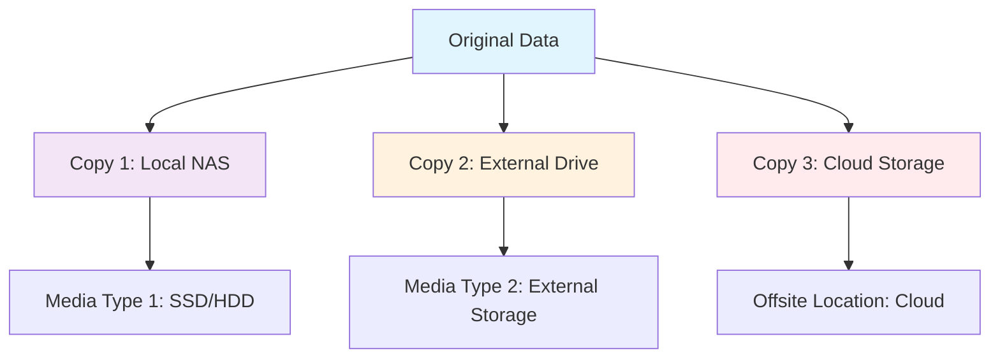

# 🔄 Backup & Disaster Recovery


## 📋 Overview

This documentation outlines our comprehensive backup strategy following the industry-standard **3-2-1 backup rule** to ensure maximum data protection and business continuity for our homelab infrastructure.

## 🎯 3-2-1 Backup Strategy

  

### 📊 Strategy Breakdown



### 🔢 The Rule Explained

1. **3 Copies**: Keep three copies of important data
   - 1 Original/Production copy
   - 2 Backup copies

2. **2 Different Media Types**: Store backups on different media
   - Local storage (NAS, SSD, HDD)
   - External storage (USB drives, tapes)

3. **1 Offsite Copy**: Keep one copy in a different location
   - Cloud storage
   - Remote location
   - Different building/facility

## 🏗️ Infrastructure Components

### 💾 Primary Storage

- **Model**: Synology DS918+
- **Configuration**: RAID 5 + Hot Spare
- **Capacity**: 12TB usable
- **Purpose**: Primary data storage

### 🖥️ Proxmox Hosts

- **Host 1**: Dell OptiPlex 7040 (Primary)
- **Host 2**: Dell OptiPlex 7040 (Secondary)
- **Storage**: NVMe SSD + HDD
- **Backup**: VM snapshots + full backups

### ☁️ Cloud Storage

- **Primary**: AWS S3 Glacier
- **Secondary**: Google Drive
- **Tertiary**: Backblaze B2

## 📅 Backup Schedule

### 🔄 Automated Backups

| **Frequency** | **Type** | **Source** | **Destination** | **Retention** |
|---------------|----------|------------|-----------------|---------------|
| **Hourly** | Snapshots | Proxmox VMs | Local ZFS | 24 hours |
| **Daily** | Incremental | Critical Data | NAS RAID 5 | 30 days |
| **Weekly** | Full VM Backup | All VMs | External Drive | 12 weeks |
| **Monthly** | Archive | Complete System | Cloud Storage | 12 months |

### 📊 Priority Matrix

```yaml
Priority Levels:
  🔴 Critical (RTO: 1 hour, RPO: 15 min):
    - Proxmox configurations
    - Active VMs
    - Database systems
    - Security configs
  
  🟠 High (RTO: 4 hours, RPO: 1 hour):
    - Application data
    - User files
    - Docker configs
    - Monitoring data
  
  🟡 Medium (RTO: 24 hours, RPO: 4 hours):
    - Media files
    - Documentation
    - Logs
    - Temporary data
  
  🟢 Low (RTO: 7 days, RPO: 24 hours):
    - Archive data
    - Old backups
    - Test environments
```

## 🛡️ Data Protection Levels

### 🔴 **Tier 1: Critical Systems**
- **RTO**: 1 hour
- **RPO**: 15 minutes
- **Backup Frequency**: Hourly snapshots
- **Storage**: Local + Cloud
- **Examples**: Proxmox, Databases, Security

### 🟠 **Tier 2: Production Services**
- **RTO**: 4 hours
- **RPO**: 1 hour
- **Backup Frequency**: Daily incremental
- **Storage**: NAS + External + Cloud
- **Examples**: Docker containers, Web services

### 🟡 **Tier 3: Standard Data**
- **RTO**: 24 hours
- **RPO**: 4 hours
- **Backup Frequency**: Weekly full
- **Storage**: NAS + Cloud
- **Examples**: Media, Documents

### 🟢 **Tier 4: Archive Data**
- **RTO**: 7 days
- **RPO**: 24 hours
- **Backup Frequency**: Monthly archive
- **Storage**: Cold storage
- **Examples**: Old files, Logs

## 📁 Backup Categories

### 🖥️ [Proxmox Backups](proxmox/)
- VM snapshots and full backups
- Configuration backups
- Storage pool backups
- Cluster configuration

### 🐳 [Docker Container Backups](docker/)
- Volume backups
- Configuration backups
- Image backups
- Compose file backups

### 💾 [Database Backups](databases/)
- SQL dumps
- Binary backups
- Transaction logs
- Point-in-time recovery

### 📱 [Application Backups](applications/)
- Application-specific backups
- Configuration files
- User data
- Plugin/extension data

### 🌐 [System Configuration Backups](system/)
- Network configurations
- Security settings
- User accounts
- System configurations

## 🔧 Backup Tools & Technologies

### 
- **Purpose**: VM and container backups
- **Features**: Deduplication, encryption, incremental
- **Schedule**: Automated daily/weekly

### 
- **Purpose**: File-level backups
- **Features**: Encryption, deduplication, cross-platform
- **Schedule**: Daily incremental

### 
- **Purpose**: NAS data protection
- **Features**: Versioning, encryption, cloud sync
- **Schedule**: Continuous sync

### 
- **Purpose**: Container data backup
- **Features**: Volume snapshots, automated scripts
- **Schedule**: Pre-update and daily

## 📈 Monitoring & Alerting

### 🔍 Backup Monitoring
```yaml
Monitoring Tools:
  - Grafana dashboards
  - Prometheus metrics
  - Email notifications
  - Slack alerts
  - SMS for critical failures

Key Metrics:
  - Backup success rate
  - Backup duration
  - Storage utilization
  - Recovery time testing
  - Data integrity checks
```

### 🚨 Alert Conditions
- Backup failure
- Storage space low
- Integrity check failure
- RTO/RPO violations
- Hardware failures

## 🧪 Testing & Validation

### 🔬 Regular Testing Schedule
- **Daily**: Automated integrity checks
- **Weekly**: Sample restore tests
- **Monthly**: Full disaster recovery drill
- **Quarterly**: Complete system recovery test

### ✅ Validation Procedures
1. **Backup Integrity**: Checksum verification
2. **Restore Testing**: Regular restore drills
3. **Performance Testing**: Backup/restore speed
4. **Documentation**: Procedure validation

## 📋 Standard Operating Procedures

### 🚀 [Quick Start Guide](quick-start/)
- Emergency procedures
- Critical system recovery
- Contact information

### 📖 [Detailed Procedures](procedures/)
- Step-by-step recovery guides
- Troubleshooting procedures
- Vendor contact information

### 🔧 [Automation Scripts](scripts/)
- Backup automation
- Monitoring scripts
- Recovery automation

## 🎯 Recovery Objectives

### 📊 Service Level Targets

| **Service** | **RTO** | **RPO** | **Availability** |
|-------------|---------|---------|------------------|
| Core Infrastructure | 1 hour | 15 min | 99.9% |
| Production Services | 4 hours | 1 hour | 99.5% |
| Development | 24 hours | 4 hours | 95% |
| Archive Data | 7 days | 24 hours | 90% |

## 📝 Documentation Standards

### 📋 Required Documentation
- Backup procedures
- Recovery procedures
- Test results
- Change logs
- Contact information

### 🔄 Review Schedule
- **Monthly**: Procedure review
- **Quarterly**: Strategy review
- **Annually**: Complete overhaul

---

## 🚀 Quick Links

- [🖥️ Proxmox Backups](proxmox/) - Virtual machine and container backups
- [🐳 Docker Backups](docker/) - Container and volume backups  
- [💾 Database Backups](databases/) - Database-specific backup procedures
- [📱 Application Backups](applications/) - Application-specific backup guides
- [🔧 Automation Scripts](scripts/) - Backup automation and monitoring scripts
- [📋 Standard Procedures](procedures/) - Standard operating procedures
- [🧪 Testing & Validation](testing/) - Backup testing and validation procedures

---

**⚠️ Important**: This backup strategy is designed to protect against multiple failure scenarios including hardware failure, human error, natural disasters, and cyber attacks. Regular testing and validation are crucial for ensuring recovery capabilities.
