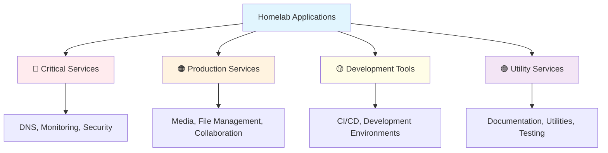

# 📱 Application Backup Procedures


## 📋 Overview

This section provides detailed backup procedures for all applications running in our homelab infrastructure. Each application has specific backup requirements and procedures to ensure data integrity and quick recovery.

## 🏗️ Application Infrastructure

### 📊 Application Categories



## 🔴 Critical Services

### 

#### Backup Configuration
```yaml
Service: Pi-hole
Priority: Critical (RTO: 15 min, RPO: 1 hour)
Location: pve1/docker
Port: 80, 53
Data Paths:
  - /opt/pihole/etc-pihole/
  - /opt/pihole/etc-dnsmasq.d/
```

#### Backup Procedure
```bash
#!/bin/bash
# Pi-hole backup script

BACKUP_DIR="/backup/pihole/$(date +%Y%m%d)"
mkdir -p $BACKUP_DIR

# Stop Pi-hole container
docker stop pihole

# Backup configuration files
cp -r /opt/pihole/etc-pihole/ $BACKUP_DIR/
cp -r /opt/pihole/etc-dnsmasq.d/ $BACKUP_DIR/

# Backup custom DNS entries
docker exec pihole cat /etc/hosts > $BACKUP_DIR/custom-hosts.txt

# Export blocklists and whitelist
docker exec pihole pihole -a -t > $BACKUP_DIR/teleporter-backup.tar.gz

# Create compressed archive
tar -czf $BACKUP_DIR.tar.gz -C /backup/pihole $(date +%Y%m%d)

# Start Pi-hole container
docker start pihole

# Verify backup
if [ -f "$BACKUP_DIR.tar.gz" ]; then
    echo "Pi-hole backup completed successfully"
else
    echo "Pi-hole backup failed"
    exit 1
fi
```

#### Recovery Procedure
```bash
#!/bin/bash
# Pi-hole recovery script

RESTORE_DATE=$1
BACKUP_FILE="/backup/pihole/${RESTORE_DATE}.tar.gz"

# Extract backup
tar -xzf $BACKUP_FILE -C /backup/pihole/

# Stop Pi-hole
docker stop pihole

# Restore configuration
cp -r /backup/pihole/${RESTORE_DATE}/etc-pihole/* /opt/pihole/etc-pihole/
cp -r /backup/pihole/${RESTORE_DATE}/etc-dnsmasq.d/* /opt/pihole/etc-dnsmasq.d/

# Start Pi-hole
docker start pihole

# Import teleporter backup
docker exec pihole pihole -a -r /backup/pihole/${RESTORE_DATE}/teleporter-backup.tar.gz
```

### 

#### Backup Configuration
```yaml
Service: Prometheus
Priority: Critical (RTO: 30 min, RPO: 15 min)
Location: pve1/docker
Port: 9090
Data Paths:
  - /opt/prometheus/data/
  - /opt/prometheus/config/
```

#### Backup Procedure
```bash
#!/bin/bash
# Prometheus backup script

BACKUP_DIR="/backup/prometheus/$(date +%Y%m%d_%H%M%S)"
mkdir -p $BACKUP_DIR

# Create snapshot via API
curl -XPOST http://localhost:9090/api/v1/admin/tsdb/snapshot

# Get snapshot name
SNAPSHOT_NAME=$(ls -t /opt/prometheus/data/snapshots/ | head -1)

# Copy snapshot data
cp -r /opt/prometheus/data/snapshots/$SNAPSHOT_NAME $BACKUP_DIR/data

# Backup configuration
cp -r /opt/prometheus/config/ $BACKUP_DIR/

# Backup rules and alerts
cp -r /opt/prometheus/rules/ $BACKUP_DIR/

# Create compressed archive
tar -czf $BACKUP_DIR.tar.gz -C /backup/prometheus $(basename $BACKUP_DIR)

# Cleanup snapshot
rm -rf /opt/prometheus/data/snapshots/$SNAPSHOT_NAME

echo "Prometheus backup completed: $BACKUP_DIR.tar.gz"
```

### 

#### Backup Configuration
```yaml
Service: Grafana
Priority: High (RTO: 1 hour, RPO: 4 hours)
Location: pve2/docker
Port: 3000
Data Paths:
  - /opt/grafana/data/
  - /opt/grafana/config/
```

#### Backup Procedure
```bash
#!/bin/bash
# Grafana backup script

BACKUP_DIR="/backup/grafana/$(date +%Y%m%d)"
mkdir -p $BACKUP_DIR

# Backup SQLite database
docker exec grafana cp /var/lib/grafana/grafana.db /tmp/
docker cp grafana:/tmp/grafana.db $BACKUP_DIR/

# Backup configuration
docker cp grafana:/etc/grafana/grafana.ini $BACKUP_DIR/

# Export dashboards via API
GRAFANA_API_KEY="your_api_key"
curl -H "Authorization: Bearer $GRAFANA_API_KEY" \
     http://localhost:3000/api/search | \
     jq -r '.[] | select(.type == "dash-db") | .uid' | \
     while read uid; do
         curl -H "Authorization: Bearer $GRAFANA_API_KEY" \
              "http://localhost:3000/api/dashboards/uid/$uid" > \
              "$BACKUP_DIR/dashboard-$uid.json"
     done

# Export data sources
curl -H "Authorization: Bearer $GRAFANA_API_KEY" \
     http://localhost:3000/api/datasources > \
     $BACKUP_DIR/datasources.json

# Create archive
tar -czf $BACKUP_DIR.tar.gz -C /backup/grafana $(date +%Y%m%d)
```

## 🟠 Production Services

### 

#### Backup Configuration
```yaml
Service: Plex Media Server
Priority: High (RTO: 4 hours, RPO: 24 hours)
Location: Synology NAS
Port: 32400
Data Paths:
  - /volume1/plex/config/
  - /volume1/plex/transcode/
  - /volume1/media/ (content only)
```

#### Backup Procedure
```bash
#!/bin/bash
# Plex backup script

BACKUP_DIR="/backup/plex/$(date +%Y%m%d)"
mkdir -p $BACKUP_DIR

# Stop Plex container
docker stop plex

# Backup Plex configuration
tar -czf $BACKUP_DIR/plex-config.tar.gz -C /volume1/plex config/

# Backup Plex database
cp /volume1/plex/config/Library/Application\ Support/Plex\ Media\ Server/Plug-in\ Support/Databases/com.plexapp.plugins.library.db \
   $BACKUP_DIR/plex-library.db

# Backup preferences
cp "/volume1/plex/config/Library/Application Support/Plex Media Server/Preferences.xml" \
   $BACKUP_DIR/

# Start Plex container
docker start plex

# Verify database integrity
sqlite3 $BACKUP_DIR/plex-library.db "PRAGMA integrity_check;" | grep -q "ok"
if [ $? -eq 0 ]; then
    echo "Plex backup completed successfully"
else
    echo "Plex database integrity check failed"
    exit 1
fi
```

### 

#### Backup Configuration
```yaml
Service: Homarr Dashboard
Priority: Medium (RTO: 4 hours, RPO: 24 hours)
Location: pve1/docker
Port: 7575
Data Paths:
  - /opt/homarr/configs/
  - /opt/homarr/data/
```

#### Backup Procedure
```bash
#!/bin/bash
# Homarr backup script

BACKUP_DIR="/backup/homarr/$(date +%Y%m%d)"
mkdir -p $BACKUP_DIR

# Backup configuration files
docker exec homarr tar -czf /tmp/homarr-backup.tar.gz /app/data/configs/
docker cp homarr:/tmp/homarr-backup.tar.gz $BACKUP_DIR/

# Backup database
docker exec homarr cp /app/data/db.sqlite $BACKUP_DIR/

# Backup custom icons and assets
docker exec homarr tar -czf /tmp/homarr-assets.tar.gz /app/public/icons/
docker cp homarr:/tmp/homarr-assets.tar.gz $BACKUP_DIR/

echo "Homarr backup completed"
```

### 

#### Backup Configuration
```yaml
Service: Trillium Notes
Priority: High (RTO: 2 hours, RPO: 4 hours)
Location: pve1/docker
Port: 8080
Data Paths:
  - /opt/trillium/data/
```

#### Backup Procedure
```bash
#!/bin/bash
# Trillium backup script

BACKUP_DIR="/backup/trillium/$(date +%Y%m%d_%H%M%S)"
mkdir -p $BACKUP_DIR

# Create database backup via API
curl -X POST http://localhost:8080/api/backup/now \
     -H "Authorization: your_api_token"

# Wait for backup completion
sleep 30

# Copy database backup
LATEST_BACKUP=$(ls -t /opt/trillium/data/backup/ | head -1)
cp "/opt/trillium/data/backup/$LATEST_BACKUP" $BACKUP_DIR/

# Backup configuration
cp /opt/trillium/data/config.ini $BACKUP_DIR/

# Verify backup integrity
if [ -f "$BACKUP_DIR/$LATEST_BACKUP" ]; then
    echo "Trillium backup completed successfully"
else
    echo "Trillium backup failed"
    exit 1
fi
```

## 🟡 Development Tools

### 

#### Backup Configuration
```yaml
Service: Jenkins
Priority: Medium (RTO: 8 hours, RPO: 24 hours)
Location: pve2/docker
Port: 8080
Data Paths:
  - /var/jenkins_home/
```

#### Backup Procedure
```bash
#!/bin/bash
# Jenkins backup script

BACKUP_DIR="/backup/jenkins/$(date +%Y%m%d)"
mkdir -p $BACKUP_DIR

# Stop Jenkins gracefully
docker exec jenkins java -jar /var/jenkins_home/war/WEB-INF/jenkins-cli.jar \
    -s http://localhost:8080 safe-shutdown

# Wait for shutdown
sleep 60

# Backup Jenkins home
tar --exclude='workspace' --exclude='builds/*/workspace' \
    -czf $BACKUP_DIR/jenkins-home.tar.gz \
    -C /opt/jenkins jenkins_home/

# Backup plugins list
docker exec jenkins ls /var/jenkins_home/plugins/ > $BACKUP_DIR/plugins.txt

# Start Jenkins
docker start jenkins

echo "Jenkins backup completed"
```

### 

#### Backup Configuration
```yaml
Service: OneDev Git Server
Priority: High (RTO: 4 hours, RPO: 12 hours)
Location: pve1/docker
Port: 6610
Data Paths:
  - /opt/onedev/data/
```

#### Backup Procedure
```bash
#!/bin/bash
# OneDev backup script

BACKUP_DIR="/backup/onedev/$(date +%Y%m%d)"
mkdir -p $BACKUP_DIR

# Create application backup
docker exec onedev /opt/onedev/bin/backup.sh /tmp/onedev-backup.zip

# Copy backup file
docker cp onedev:/tmp/onedev-backup.zip $BACKUP_DIR/

# Backup git repositories separately
tar -czf $BACKUP_DIR/git-repos.tar.gz -C /opt/onedev/data repositories/

echo "OneDev backup completed"
```

## 🟢 Utility Services

### 

#### Backup Configuration
```yaml
Service: AdGuard Home
Priority: Medium (RTO: 4 hours, RPO: 24 hours)
Location: pve2/docker
Port: 3000, 53
Data Paths:
  - /opt/adguard/work/
  - /opt/adguard/conf/
```

#### Backup Procedure
```bash
#!/bin/bash
# AdGuard backup script

BACKUP_DIR="/backup/adguard/$(date +%Y%m%d)"
mkdir -p $BACKUP_DIR

# Backup configuration
cp /opt/adguard/conf/AdGuardHome.yaml $BACKUP_DIR/

# Backup query logs and statistics
tar -czf $BACKUP_DIR/adguard-data.tar.gz \
    -C /opt/adguard work/

echo "AdGuard backup completed"
```

### 

#### Backup Configuration
```yaml
Service: MinIO Object Storage
Priority: High (RTO: 2 hours, RPO: 6 hours)
Location: pve2/docker
Port: 9000, 9001
Data Paths:
  - /opt/minio/data/
```

#### Backup Procedure
```bash
#!/bin/bash
# MinIO backup script

BACKUP_DIR="/backup/minio/$(date +%Y%m%d)"
mkdir -p $BACKUP_DIR

# Backup MinIO data
mc mirror minio-local/ $BACKUP_DIR/data/

# Backup configuration
docker exec minio cat /etc/minio/config.json > $BACKUP_DIR/config.json

# Export bucket policies
mc admin policy list minio-local > $BACKUP_DIR/policies.txt

echo "MinIO backup completed"
```

## 🔧 Automation Scripts

### 📅 Master Backup Script
```bash
#!/bin/bash
# Master application backup script

LOG_FILE="/var/log/app-backup.log"
BACKUP_ROOT="/backup/applications"
DATE=$(date +%Y%m%d)

# Logging function
log_message() {
    echo "$(date '+%Y-%m-%d %H:%M:%S') - $1" | tee -a $LOG_FILE
}

# Application backup functions
backup_pihole() {
    log_message "Starting Pi-hole backup..."
    /usr/local/bin/backup-pihole.sh
}

backup_prometheus() {
    log_message "Starting Prometheus backup..."
    /usr/local/bin/backup-prometheus.sh
}

backup_grafana() {
    log_message "Starting Grafana backup..."
    /usr/local/bin/backup-grafana.sh
}

backup_plex() {
    log_message "Starting Plex backup..."
    /usr/local/bin/backup-plex.sh
}

backup_homarr() {
    log_message "Starting Homarr backup..."
    /usr/local/bin/backup-homarr.sh
}

backup_trillium() {
    log_message "Starting Trillium backup..."
    /usr/local/bin/backup-trillium.sh
}

backup_jenkins() {
    log_message "Starting Jenkins backup..."
    /usr/local/bin/backup-jenkins.sh
}

backup_onedev() {
    log_message "Starting OneDev backup..."
    /usr/local/bin/backup-onedev.sh
}

backup_adguard() {
    log_message "Starting AdGuard backup..."
    /usr/local/bin/backup-adguard.sh
}

backup_minio() {
    log_message "Starting MinIO backup..."
    /usr/local/bin/backup-minio.sh
}

# Main execution
main() {
    log_message "=== Starting Application Backup Process ==="
    
    # Create daily backup directory
    mkdir -p "$BACKUP_ROOT/$DATE"
    
    # Critical services (daily)
    backup_pihole
    backup_prometheus
    
    # Production services (daily)
    backup_grafana
    backup_plex
    backup_homarr
    backup_trillium
    
    # Development tools (weekly - only on Sundays)
    if [ $(date +%u) -eq 7 ]; then
        backup_jenkins
        backup_onedev
    fi
    
    # Utility services (daily)
    backup_adguard
    backup_minio
    
    # Compress daily backup
    tar -czf "$BACKUP_ROOT/app-backup-$DATE.tar.gz" -C "$BACKUP_ROOT" "$DATE"
    
    # Cleanup individual directories
    rm -rf "$BACKUP_ROOT/$DATE"
    
    # Cleanup old backups (keep 30 days)
    find "$BACKUP_ROOT" -name "app-backup-*.tar.gz" -mtime +30 -delete
    
    log_message "=== Application Backup Process Completed ==="
}

# Execute main function
main "$@"
```

### 📊 Backup Monitoring
```bash
#!/bin/bash
# Application backup monitoring script

PROMETHEUS_PUSHGATEWAY="http://monitoring.homelab.local:9091"
BACKUP_ROOT="/backup/applications"

# Check backup status for each application
check_app_backup() {
    local app_name=$1
    local backup_path=$2
    
    # Check if backup exists for today
    if find "$backup_path" -name "*$(date +%Y%m%d)*" -type f | grep -q .; then
        backup_status=1
    else
        backup_status=0
    fi
    
    # Send metrics to Prometheus
    cat <<EOF | curl -X POST --data-binary @- $PROMETHEUS_PUSHGATEWAY/metrics/job/app_backup_monitor
app_backup_status{app="$app_name"} $backup_status
EOF
}

# Monitor all applications
check_app_backup "pihole" "/backup/pihole"
check_app_backup "prometheus" "/backup/prometheus"
check_app_backup "grafana" "/backup/grafana"
check_app_backup "plex" "/backup/plex"
check_app_backup "homarr" "/backup/homarr"
check_app_backup "trillium" "/backup/trillium"
check_app_backup "jenkins" "/backup/jenkins"
check_app_backup "onedev" "/backup/onedev"
check_app_backup "adguard" "/backup/adguard"
check_app_backup "minio" "/backup/minio"
```

## 📅 Backup Schedule

### 🕐 Cron Configuration
```bash
# /etc/crontab entries for application backups

# Critical services - every 4 hours
0 */4 * * * root /usr/local/bin/backup-pihole.sh
0 */4 * * * root /usr/local/bin/backup-prometheus.sh

# Production services - daily at 2 AM
0 2 * * * root /usr/local/bin/backup-grafana.sh
0 2 * * * root /usr/local/bin/backup-plex.sh
0 2 * * * root /usr/local/bin/backup-homarr.sh
0 2 * * * root /usr/local/bin/backup-trillium.sh

# Development tools - weekly on Sunday
0 3 * * 0 root /usr/local/bin/backup-jenkins.sh
0 3 * * 0 root /usr/local/bin/backup-onedev.sh

# Utility services - daily at 4 AM
0 4 * * * root /usr/local/bin/backup-adguard.sh
0 4 * * * root /usr/local/bin/backup-minio.sh

# Master backup script - daily at 6 AM
0 6 * * * root /usr/local/bin/master-app-backup.sh

# Backup monitoring - every hour
0 * * * * root /usr/local/bin/app-backup-monitor.sh
```

## 🧪 Recovery Testing

### 📋 Monthly Recovery Test
```bash
#!/bin/bash
# Application recovery testing script

TEST_DATE=$1
LOG_FILE="/var/log/recovery-test.log"

log_message() {
    echo "$(date '+%Y-%m-%d %H:%M:%S') - $1" | tee -a $LOG_FILE
}

# Test Pi-hole recovery
test_pihole_recovery() {
    log_message "Testing Pi-hole recovery..."
    
    # Create test container
    docker run -d --name pihole-test \
        -p 8053:53/tcp -p 8053:53/udp \
        -p 8080:80 \
        pihole/pihole:latest
    
    # Restore backup
    tar -xzf "/backup/pihole/pihole-$TEST_DATE.tar.gz" -C /tmp/
    docker cp /tmp/pihole-$TEST_DATE/etc-pihole/. pihole-test:/etc/pihole/
    
    # Test functionality
    docker exec pihole-test pihole status
    
    # Cleanup
    docker stop pihole-test
    docker rm pihole-test
    rm -rf /tmp/pihole-$TEST_DATE
    
    log_message "Pi-hole recovery test completed"
}

# Execute tests
log_message "=== Starting Recovery Testing ==="
test_pihole_recovery
log_message "=== Recovery Testing Completed ==="
```

## 📊 Backup Metrics & Reporting

### 📈 Daily Backup Report
```bash
#!/bin/bash
# Generate daily backup report

REPORT_DATE=$(date +%Y-%m-%d)
REPORT_FILE="/var/log/backup-report-$REPORT_DATE.html"

cat > $REPORT_FILE << EOF
<!DOCTYPE html>
<html>
<head>
    <title>Homelab Backup Report - $REPORT_DATE</title>
    <style>
        body { font-family: Arial, sans-serif; margin: 20px; }
        .success { color: green; }
        .failure { color: red; }
        .warning { color: orange; }
        table { border-collapse: collapse; width: 100%; }
        th, td { border: 1px solid #ddd; padding: 8px; text-align: left; }
        th { background-color: #f2f2f2; }
    </style>
</head>
<body>
    <h1>🏠 Homelab Backup Report</h1>
    <h2>Date: $REPORT_DATE</h2>
    
    <table>
        <tr>
            <th>Application</th>
            <th>Status</th>
            <th>Backup Size</th>
            <th>Last Backup</th>
            <th>Next Backup</th>
        </tr>
EOF

# Add application status to report
add_app_status() {
    local app=$1
    local backup_path=$2
    
    if [ -f "$backup_path" ]; then
        status="<span class='success'>✅ Success</span>"
        size=$(du -h "$backup_path" | cut -f1)
        last_backup=$(stat -c %y "$backup_path" | cut -d' ' -f1)
    else
        status="<span class='failure'>❌ Failed</span>"
        size="N/A"
        last_backup="N/A"
    fi
    
    cat >> $REPORT_FILE << EOF
        <tr>
            <td>$app</td>
            <td>$status</td>
            <td>$size</td>
            <td>$last_backup</td>
            <td>Next scheduled backup</td>
        </tr>
EOF
}

# Add all applications
add_app_status "Pi-hole" "/backup/pihole/pihole-$(date +%Y%m%d).tar.gz"
add_app_status "Prometheus" "/backup/prometheus/prometheus-$(date +%Y%m%d).tar.gz"
add_app_status "Grafana" "/backup/grafana/grafana-$(date +%Y%m%d).tar.gz"

cat >> $REPORT_FILE << EOF
    </table>
    
    <h3>📊 Summary</h3>
    <p>Total applications backed up: <strong>10</strong></p>
    <p>Successful backups: <strong id="success-count">0</strong></p>
    <p>Failed backups: <strong id="failure-count">0</strong></p>
    
    <p><em>Report generated on $(date)</em></p>
</body>
</html>
EOF

echo "Backup report generated: $REPORT_FILE"
```

---

## 🔗 Related Documentation

- [📋 Main Backup Strategy](../) - Overall backup strategy
- [🖥️ Proxmox Backups](../proxmox/) - VM and container backups
- [🐳 Docker Backups](../docker/) - Container backup procedures
- [💾 Database Backups](../databases/) - Database-specific backups
- [🔧 Backup Scripts](../scripts/) - Automation scripts

---

**⚠️ Important Notes**: 
- Always test application-specific restore procedures
- Some applications may require specific shutdown procedures before backup
- Monitor backup sizes and adjust retention policies accordingly
- Keep application documentation updated with any configuration changes
