# 💾 Database Backup Strategy

 

## 📋 Overview

This guide provides comprehensive backup procedures for all database systems in our homelab infrastructure, including MySQL/MariaDB, PostgreSQL, SQLite, and specialized databases, following the 3-2-1 backup strategy.

## 🗄️ Database Infrastructure

### 📊 Database Inventory

```mermaid
graph TB
    A[Database Systems] --> B[🔴 Production DBs]
    A --> C[🟠 Application DBs]
    A --> D[🟡 Development DBs]
    A --> E[🟢 Utility DBs]
    
    B --> F[MySQL: User Management]
    B --> G[PostgreSQL: Analytics]
    B --> H[InfluxDB: Metrics]
    
    C --> I[SQLite: Grafana]
    C --> J[SQLite: Trillium]
    C --> K[MySQL: Plex]
    
    D --> L[PostgreSQL: Dev]
    D --> M[MySQL: Testing]
    
    E --> N[SQLite: Config DBs]
    E --> O[Redis: Cache]
    
    style A fill:#e1f5fe
    style B fill:#ffebee
    style C fill:#fff3e0
    style D fill:#fffde7
    style E fill:#f3e5f5
```



### 🏗️ Database Hosts

#### Primary Database Server (pve1)
```yaml
Host: pve1.homelab.local
Services:
  - MySQL/MariaDB: Port 3306
  - PostgreSQL: Port 5432
  - InfluxDB: Port 8086
  - Redis: Port 6379
Storage: /var/lib/mysql, /var/lib/postgresql
Backup Storage: /backup/databases/
```

#### Secondary Database Server (pve2)
```yaml
Host: pve2.homelab.local
Services:
  - PostgreSQL: Port 5432 (dev)
  - MySQL: Port 3306 (testing)
Storage: /var/lib/mysql, /var/lib/postgresql
Backup Storage: /backup/databases/
```

#### Application Databases (Containers)
```yaml
Location: Docker containers
SQLite Databases:
  - Grafana: /var/lib/grafana/grafana.db
  - Trillium: /opt/trillium/data/document.db
  - Homarr: /app/data/db.sqlite
  - AdGuard: /opt/adguard/data/stats.db
```

## 🔄 Backup Strategy Overview

### 📅 Backup Schedule Matrix

| **Database Type** | **Frequency** | **Method** | **Retention** | **RTO** | **RPO** |
|-------------------|---------------|------------|---------------|---------|---------|
| **Production MySQL** | Every 6 hours | Full + Binary logs | 30 days | 1 hour | 15 min |
| **Production PostgreSQL** | Every 6 hours | pg_dump + WAL | 30 days | 1 hour | 15 min |
| **InfluxDB** | Daily | Snapshot + Export | 14 days | 4 hours | 1 hour |
| **Application SQLite** | Daily | File copy + dump | 30 days | 2 hours | 4 hours |
| **Development DBs** | Weekly | Full dump | 4 weeks | 24 hours | 1 week |
| **Redis Cache** | Daily | RDB + AOF | 7 days | 1 hour | 1 hour |

## 

### 🔧 MySQL/MariaDB Backup Script
```bash
#!/bin/bash
# MySQL/MariaDB backup script

source /usr/local/bin/backup/master/backup-config.conf
source /usr/local/bin/backup/master/backup-functions.sh

# MySQL Configuration
MYSQL_USER="backup_user"
MYSQL_PASSWORD_FILE="/etc/backup/mysql_password"
MYSQL_HOST="localhost"
MYSQL_PORT="3306"
BACKUP_DIR="/backup/databases/mysql/$(date +%Y%m%d)"
LOG_FILE="/var/log/mysql-backup.log"

# Read MySQL password
MYSQL_PASSWORD=$(cat "$MYSQL_PASSWORD_FILE")

# Create MySQL configuration file
create_mysql_config() {
    local config_file="/tmp/.my.cnf.$$"
    cat > "$config_file" << EOF
[client]
user=$MYSQL_USER
password=$MYSQL_PASSWORD
host=$MYSQL_HOST
port=$MYSQL_PORT
EOF
    chmod 600 "$config_file"
    echo "$config_file"
}

# Backup single database
backup_mysql_database() {
    local database=$1
    local config_file=$2
    local backup_file="$BACKUP_DIR/${database}_$(date +%Y%m%d_%H%M%S).sql.gz"
    
    log_message "INFO" "Backing up MySQL database: $database"
    
    # Create backup directory
    mkdir -p "$BACKUP_DIR"
    
    # Perform backup with compression
    mysqldump --defaults-file="$config_file" \
              --single-transaction \
              --routines \
              --triggers \
              --events \
              --quick \
              --compress \
              "$database" | gzip > "$backup_file"
    
    if [ ${PIPESTATUS[0]} -eq 0 ]; then
        log_message "SUCCESS" "Successfully backed up database: $database"
        
        # Generate checksum
        generate_checksum "$backup_file"
        
        # Test backup integrity
        if gunzip -t "$backup_file" 2>/dev/null; then
            log_message "SUCCESS" "Backup integrity verified: $database"
        else
            log_message "ERROR" "Backup integrity check failed: $database"
            return 1
        fi
        
        return 0
    else
        log_message "ERROR" "Failed to backup database: $database"
        return 1
    fi
}

# Backup all databases
backup_all_mysql_databases() {
    local config_file=$(create_mysql_config)
    local failed_backups=0
    
    log_message "INFO" "Starting MySQL database backup..."
    
    # Get list of databases (excluding system databases)
    local databases=$(mysql --defaults-file="$config_file" -e "SHOW DATABASES;" | grep -v -E '^(Database|information_schema|performance_schema|mysql|sys)$')
    
    for database in $databases; do
        if ! backup_mysql_database "$database" "$config_file"; then
            failed_backups=$((failed_backups + 1))
        fi
    done
    
    # Backup binary logs
    backup_mysql_binary_logs "$config_file"
    
    # Cleanup temporary config
    rm -f "$config_file"
    
    if [ $failed_backups -eq 0 ]; then
        log_message "SUCCESS" "All MySQL databases backed up successfully"
        return 0
    else
        log_message "ERROR" "$failed_backups MySQL database backups failed"
        return 1
    fi
}

# Backup binary logs for point-in-time recovery
backup_mysql_binary_logs() {
    local config_file=$1
    local binlog_dir="$BACKUP_DIR/binlogs"
    
    log_message "INFO" "Backing up MySQL binary logs..."
    
    mkdir -p "$binlog_dir"
    
    # Get binary log files
    mysql --defaults-file="$config_file" -e "SHOW BINARY LOGS;" | tail -n +2 | while read log_file size; do
        if [ -n "$log_file" ]; then
            log_message "INFO" "Copying binary log: $log_file"
            cp "/var/lib/mysql/$log_file" "$binlog_dir/"
        fi
    done
    
    # Flush logs to create a new binary log
    mysql --defaults-file="$config_file" -e "FLUSH LOGS;"
    
    log_message "SUCCESS" "Binary logs backup completed"
}

# Restore MySQL database
restore_mysql_database() {
    local database=$1
    local backup_file=$2
    local config_file=$(create_mysql_config)
    
    log_message "INFO" "Restoring MySQL database: $database from $backup_file"
    
    # Verify backup file
    if [ ! -f "$backup_file" ]; then
        log_message "ERROR" "Backup file not found: $backup_file"
        rm -f "$config_file"
        return 1
    fi
    
    # Verify backup integrity
    if ! gunzip -t "$backup_file" 2>/dev/null; then
        log_message "ERROR" "Backup file is corrupted: $backup_file"
        rm -f "$config_file"
        return 1
    fi
    
    # Create database if it doesn't exist
    mysql --defaults-file="$config_file" -e "CREATE DATABASE IF NOT EXISTS \`$database\`;"
    
    # Restore database
    gunzip -c "$backup_file" | mysql --defaults-file="$config_file" "$database"
    
    if [ ${PIPESTATUS[1]} -eq 0 ]; then
        log_message "SUCCESS" "Successfully restored database: $database"
        rm -f "$config_file"
        return 0
    else
        log_message "ERROR" "Failed to restore database: $database"
        rm -f "$config_file"
        return 1
    fi
}

# Main execution
case "$1" in
    "backup")
        if [ -n "$2" ]; then
            config_file=$(create_mysql_config)
            backup_mysql_database "$2" "$config_file"
            rm -f "$config_file"
        else
            backup_all_mysql_databases
        fi
        ;;
    "restore")
        if [ -n "$2" ] && [ -n "$3" ]; then
            restore_mysql_database "$2" "$3"
        else
            echo "Usage: $0 restore <database_name> <backup_file>"
            exit 1
        fi
        ;;
    *)
        echo "Usage: $0 {backup [database_name]|restore <database_name> <backup_file>}"
        exit 1
        ;;
esac
```

## 

### 🐘 PostgreSQL Backup Script
```bash
#!/bin/bash
# PostgreSQL backup script

source /usr/local/bin/backup/master/backup-config.conf
source /usr/local/bin/backup/master/backup-functions.sh

# PostgreSQL Configuration
PG_USER="backup_user"
PG_HOST="localhost"
PG_PORT="5432"
BACKUP_DIR="/backup/databases/postgresql/$(date +%Y%m%d)"
LOG_FILE="/var/log/postgresql-backup.log"

# Set environment variables
export PGUSER="$PG_USER"
export PGHOST="$PG_HOST"
export PGPORT="$PG_PORT"

# Backup single PostgreSQL database
backup_postgresql_database() {
    local database=$1
    local backup_file="$BACKUP_DIR/${database}_$(date +%Y%m%d_%H%M%S).sql.gz"
    
    log_message "INFO" "Backing up PostgreSQL database: $database"
    
    # Create backup directory
    mkdir -p "$BACKUP_DIR"
    
    # Perform backup with compression
    pg_dump --verbose \
            --clean \
            --create \
            --if-exists \
            --no-password \
            "$database" | gzip > "$backup_file"
    
    if [ ${PIPESTATUS[0]} -eq 0 ]; then
        log_message "SUCCESS" "Successfully backed up database: $database"
        
        # Generate checksum
        generate_checksum "$backup_file"
        
        # Test backup integrity
        if gunzip -t "$backup_file" 2>/dev/null; then
            log_message "SUCCESS" "Backup integrity verified: $database"
        else
            log_message "ERROR" "Backup integrity check failed: $database"
            return 1
        fi
        
        return 0
    else
        log_message "ERROR" "Failed to backup database: $database"
        return 1
    fi
}

# Backup all PostgreSQL databases
backup_all_postgresql_databases() {
    local failed_backups=0
    
    log_message "INFO" "Starting PostgreSQL database backup..."
    
    # Get list of databases (excluding templates)
    local databases=$(psql -t -c "SELECT datname FROM pg_database WHERE datistemplate = false;" | grep -v '^$')
    
    for database in $databases; do
        # Trim whitespace
        database=$(echo "$database" | xargs)
        
        if ! backup_postgresql_database "$database"; then
            failed_backups=$((failed_backups + 1))
        fi
    done
    
    # Backup WAL files
    backup_postgresql_wal_files
    
    # Backup global objects
    backup_postgresql_globals
    
    if [ $failed_backups -eq 0 ]; then
        log_message "SUCCESS" "All PostgreSQL databases backed up successfully"
        return 0
    else
        log_message "ERROR" "$failed_backups PostgreSQL database backups failed"
        return 1
    fi
}

# Backup WAL files for point-in-time recovery
backup_postgresql_wal_files() {
    local wal_dir="$BACKUP_DIR/wal"
    local pg_data_dir="/var/lib/postgresql/data"
    
    log_message "INFO" "Backing up PostgreSQL WAL files..."
    
    mkdir -p "$wal_dir"
    
    # Copy WAL files
    if [ -d "$pg_data_dir/pg_wal" ]; then
        cp -r "$pg_data_dir/pg_wal"/* "$wal_dir/" 2>/dev/null || true
    elif [ -d "$pg_data_dir/pg_xlog" ]; then
        cp -r "$pg_data_dir/pg_xlog"/* "$wal_dir/" 2>/dev/null || true
    fi
    
    log_message "SUCCESS" "WAL files backup completed"
}

# Backup PostgreSQL global objects
backup_postgresql_globals() {
    local globals_file="$BACKUP_DIR/globals_$(date +%Y%m%d_%H%M%S).sql.gz"
    
    log_message "INFO" "Backing up PostgreSQL global objects..."
    
    pg_dumpall --globals-only | gzip > "$globals_file"
    
    if [ ${PIPESTATUS[0]} -eq 0 ]; then
        log_message "SUCCESS" "Global objects backup completed"
        generate_checksum "$globals_file"
    else
        log_message "ERROR" "Failed to backup global objects"
    fi
}

# Restore PostgreSQL database
restore_postgresql_database() {
    local database=$1
    local backup_file=$2
    
    log_message "INFO" "Restoring PostgreSQL database: $database from $backup_file"
    
    # Verify backup file
    if [ ! -f "$backup_file" ]; then
        log_message "ERROR" "Backup file not found: $backup_file"
        return 1
    fi
    
    # Verify backup integrity
    if ! gunzip -t "$backup_file" 2>/dev/null; then
        log_message "ERROR" "Backup file is corrupted: $backup_file"
        return 1
    fi
    
    # Restore database
    gunzip -c "$backup_file" | psql
    
    if [ ${PIPESTATUS[1]} -eq 0 ]; then
        log_message "SUCCESS" "Successfully restored database: $database"
        return 0
    else
        log_message "ERROR" "Failed to restore database: $database"
        return 1
    fi
}

# Main execution
case "$1" in
    "backup")
        if [ -n "$2" ]; then
            backup_postgresql_database "$2"
        else
            backup_all_postgresql_databases
        fi
        ;;
    "restore")
        if [ -n "$2" ] && [ -n "$3" ]; then
            restore_postgresql_database "$2" "$3"
        else
            echo "Usage: $0 restore <database_name> <backup_file>"
            exit 1
        fi
        ;;
    *)
        echo "Usage: $0 {backup [database_name]|restore <database_name> <backup_file>}"
        exit 1
        ;;
esac
```

## 

### 📱 SQLite Backup Script
```bash
#!/bin/bash
# SQLite backup script

source /usr/local/bin/backup/master/backup-config.conf
source /usr/local/bin/backup/master/backup-functions.sh

BACKUP_DIR="/backup/databases/sqlite/$(date +%Y%m%d)"
LOG_FILE="/var/log/sqlite-backup.log"

# SQLite database locations
SQLITE_DATABASES=(
    "/var/lib/grafana/grafana.db:grafana"
    "/opt/trillium/data/document.db:trillium"
    "/opt/homarr/data/db.sqlite:homarr"
    "/opt/adguard/data/stats.db:adguard"
    "/opt/pihole/etc-pihole/gravity.db:pihole"
)

# Backup single SQLite database
backup_sqlite_database() {
    local db_path=$1
    local db_name=$2
    local backup_file="$BACKUP_DIR/${db_name}_$(date +%Y%m%d_%H%M%S).db"
    local sql_dump="$BACKUP_DIR/${db_name}_$(date +%Y%m%d_%H%M%S).sql.gz"
    
    log_message "INFO" "Backing up SQLite database: $db_name"
    
    # Check if database file exists
    if [ ! -f "$db_path" ]; then
        log_message "WARNING" "Database file not found: $db_path"
        return 1
    fi
    
    # Create backup directory
    mkdir -p "$BACKUP_DIR"
    
    # Method 1: File copy (fastest)
    cp "$db_path" "$backup_file"
    
    if [ $? -eq 0 ]; then
        log_message "SUCCESS" "File copy backup completed: $db_name"
        
        # Generate checksum for file copy
        generate_checksum "$backup_file"
        
        # Method 2: SQL dump (more portable)
        sqlite3 "$db_path" .dump | gzip > "$sql_dump"
        
        if [ ${PIPESTATUS[0]} -eq 0 ]; then
            log_message "SUCCESS" "SQL dump backup completed: $db_name"
            generate_checksum "$sql_dump"
        else
            log_message "WARNING" "SQL dump backup failed: $db_name"
        fi
        
        # Verify database integrity
        if sqlite3 "$backup_file" "PRAGMA integrity_check;" | grep -q "ok"; then
            log_message "SUCCESS" "Database integrity verified: $db_name"
        else
            log_message "ERROR" "Database integrity check failed: $db_name"
            return 1
        fi
        
        return 0
    else
        log_message "ERROR" "Failed to backup database: $db_name"
        return 1
    fi
}

# Backup all SQLite databases
backup_all_sqlite_databases() {
    local failed_backups=0
    
    log_message "INFO" "Starting SQLite database backup..."
    
    for db_entry in "${SQLITE_DATABASES[@]}"; do
        local db_path=$(echo "$db_entry" | cut -d':' -f1)
        local db_name=$(echo "$db_entry" | cut -d':' -f2)
        
        if ! backup_sqlite_database "$db_path" "$db_name"; then
            failed_backups=$((failed_backups + 1))
        fi
    done
    
    if [ $failed_backups -eq 0 ]; then
        log_message "SUCCESS" "All SQLite databases backed up successfully"
        return 0
    else
        log_message "ERROR" "$failed_backups SQLite database backups failed"
        return 1
    fi
}

# Restore SQLite database
restore_sqlite_database() {
    local db_name=$1
    local backup_file=$2
    local restore_path=""
    
    log_message "INFO" "Restoring SQLite database: $db_name from $backup_file"
    
    # Find original database path
    for db_entry in "${SQLITE_DATABASES[@]}"; do
        if echo "$db_entry" | grep -q ":$db_name$"; then
            restore_path=$(echo "$db_entry" | cut -d':' -f1)
            break
        fi
    done
    
    if [ -z "$restore_path" ]; then
        log_message "ERROR" "Unknown database name: $db_name"
        return 1
    fi
    
    # Verify backup file
    if [ ! -f "$backup_file" ]; then
        log_message "ERROR" "Backup file not found: $backup_file"
        return 1
    fi
    
    # Create backup of current database
    if [ -f "$restore_path" ]; then
        cp "$restore_path" "${restore_path}.backup.$(date +%s)"
        log_message "INFO" "Current database backed up before restore"
    fi
    
    # Determine restore method based on file extension
    if [[ "$backup_file" == *.sql.gz ]]; then
        # SQL dump restore
        rm -f "$restore_path"
        gunzip -c "$backup_file" | sqlite3 "$restore_path"
        
        if [ ${PIPESTATUS[1]} -eq 0 ]; then
            log_message "SUCCESS" "Successfully restored database from SQL dump: $db_name"
        else
            log_message "ERROR" "Failed to restore database from SQL dump: $db_name"
            return 1
        fi
    else
        # File copy restore
        cp "$backup_file" "$restore_path"
        
        if [ $? -eq 0 ]; then
            log_message "SUCCESS" "Successfully restored database from file copy: $db_name"
        else
            log_message "ERROR" "Failed to restore database from file copy: $db_name"
            return 1
        fi
    fi
    
    # Verify restored database
    if sqlite3 "$restore_path" "PRAGMA integrity_check;" | grep -q "ok"; then
        log_message "SUCCESS" "Restored database integrity verified: $db_name"
        return 0
    else
        log_message "ERROR" "Restored database integrity check failed: $db_name"
        return 1
    fi
}

# Main execution
case "$1" in
    "backup")
        if [ -n "$2" ]; then
            # Find database path for given name
            for db_entry in "${SQLITE_DATABASES[@]}"; do
                if echo "$db_entry" | grep -q ":$2$"; then
                    db_path=$(echo "$db_entry" | cut -d':' -f1)
                    backup_sqlite_database "$db_path" "$2"
                    exit $?
                fi
            done
            log_message "ERROR" "Unknown database name: $2"
            exit 1
        else
            backup_all_sqlite_databases
        fi
        ;;
    "restore")
        if [ -n "$2" ] && [ -n "$3" ]; then
            restore_sqlite_database "$2" "$3"
        else
            echo "Usage: $0 restore <database_name> <backup_file>"
            exit 1
        fi
        ;;
    *)
        echo "Usage: $0 {backup [database_name]|restore <database_name> <backup_file>}"
        echo "Available databases: grafana, trillium, homarr, adguard, pihole"
        exit 1
        ;;
esac
```

## 

### 📊 InfluxDB Backup Script
```bash
#!/bin/bash
# InfluxDB backup script

source /usr/local/bin/backup/master/backup-config.conf
source /usr/local/bin/backup/master/backup-functions.sh

# InfluxDB Configuration
INFLUX_HOST="localhost"
INFLUX_PORT="8086"
INFLUX_TOKEN_FILE="/etc/backup/influxdb_token"
BACKUP_DIR="/backup/databases/influxdb/$(date +%Y%m%d)"
LOG_FILE="/var/log/influxdb-backup.log"

# Read InfluxDB token
INFLUX_TOKEN=$(cat "$INFLUX_TOKEN_FILE")

# Backup InfluxDB v2.x
backup_influxdb_v2() {
    local org=$1
    local backup_path="$BACKUP_DIR/influxdb_${org}_$(date +%Y%m%d_%H%M%S)"
    
    log_message "INFO" "Backing up InfluxDB organization: $org"
    
    # Create backup directory
    mkdir -p "$backup_path"
    
    # Backup using influx CLI
    influx backup "$backup_path" \
           --host "http://$INFLUX_HOST:$INFLUX_PORT" \
           --token "$INFLUX_TOKEN" \
           --org "$org"
    
    if [ $? -eq 0 ]; then
        log_message "SUCCESS" "Successfully backed up organization: $org"
        
        # Compress backup
        tar -czf "${backup_path}.tar.gz" -C "$BACKUP_DIR" "$(basename "$backup_path")"
        rm -rf "$backup_path"
        
        # Generate checksum
        generate_checksum "${backup_path}.tar.gz"
        
        return 0
    else
        log_message "ERROR" "Failed to backup organization: $org"
        return 1
    fi
}

# Backup all InfluxDB organizations
backup_all_influxdb_orgs() {
    local failed_backups=0
    
    log_message "INFO" "Starting InfluxDB backup..."
    
    # Get list of organizations
    local orgs=$(influx org list --host "http://$INFLUX_HOST:$INFLUX_PORT" --token "$INFLUX_TOKEN" --json | jq -r '.[].name')
    
    for org in $orgs; do
        if ! backup_influxdb_v2 "$org"; then
            failed_backups=$((failed_backups + 1))
        fi
    done
    
    if [ $failed_backups -eq 0 ]; then
        log_message "SUCCESS" "All InfluxDB organizations backed up successfully"
        return 0
    else
        log_message "ERROR" "$failed_backups InfluxDB organization backups failed"
        return 1
    fi
}

# Restore InfluxDB backup
restore_influxdb() {
    local org=$1
    local backup_file=$2
    
    log_message "INFO" "Restoring InfluxDB organization: $org from $backup_file"
    
    # Verify backup file
    if [ ! -f "$backup_file" ]; then
        log_message "ERROR" "Backup file not found: $backup_file"
        return 1
    fi
    
    # Extract backup
    local temp_dir="/tmp/influxdb_restore_$$"
    mkdir -p "$temp_dir"
    tar -xzf "$backup_file" -C "$temp_dir"
    
    # Find extracted directory
    local backup_dir=$(find "$temp_dir" -type d -name "influxdb_*" | head -1)
    
    if [ -z "$backup_dir" ]; then
        log_message "ERROR" "Could not find backup directory in archive"
        rm -rf "$temp_dir"
        return 1
    fi
    
    # Restore using influx CLI
    influx restore "$backup_dir" \
           --host "http://$INFLUX_HOST:$INFLUX_PORT" \
           --token "$INFLUX_TOKEN" \
           --org "$org"
    
    if [ $? -eq 0 ]; then
        log_message "SUCCESS" "Successfully restored organization: $org"
        rm -rf "$temp_dir"
        return 0
    else
        log_message "ERROR" "Failed to restore organization: $org"
        rm -rf "$temp_dir"
        return 1
    fi
}

# Main execution
case "$1" in
    "backup")
        if [ -n "$2" ]; then
            backup_influxdb_v2 "$2"
        else
            backup_all_influxdb_orgs
        fi
        ;;
    "restore")
        if [ -n "$2" ] && [ -n "$3" ]; then
            restore_influxdb "$2" "$3"
        else
            echo "Usage: $0 restore <organization> <backup_file>"
            exit 1
        fi
        ;;
    *)
        echo "Usage: $0 {backup [organization]|restore <organization> <backup_file>}"
        exit 1
        ;;
esac
```

## 🔄 Master Database Backup Script

### 🎯 Centralized Database Backup
```bash
#!/bin/bash
# Master database backup script

source /usr/local/bin/backup/master/backup-config.conf
source /usr/local/bin/backup/master/backup-functions.sh

DATABASE_BACKUP_DIR="/backup/databases/$(date +%Y%m%d)"
LOG_FILE="/var/log/database-backup.log"

# Execute database backup stages
execute_database_backups() {
    log_message "INFO" "Starting master database backup process..."
    
    local failed_backups=0
    
    # Create backup directory
    mkdir -p "$DATABASE_BACKUP_DIR"
    
    # MySQL/MariaDB backups
    if systemctl is-active --quiet mysql || systemctl is-active --quiet mariadb; then
        log_message "INFO" "Executing MySQL/MariaDB backups..."
        if ! /usr/local/bin/backup/databases/mysql-backup.sh backup; then
            failed_backups=$((failed_backups + 1))
            log_message "ERROR" "MySQL backup failed"
        fi
    else
        log_message "INFO" "MySQL/MariaDB service not running, skipping backup"
    fi
    
    # PostgreSQL backups
    if systemctl is-active --quiet postgresql; then
        log_message "INFO" "Executing PostgreSQL backups..."
        if ! /usr/local/bin/backup/databases/postgresql-backup.sh backup; then
            failed_backups=$((failed_backups + 1))
            log_message "ERROR" "PostgreSQL backup failed"
        fi
    else
        log_message "INFO" "PostgreSQL service not running, skipping backup"
    fi
    
    # SQLite backups
    log_message "INFO" "Executing SQLite backups..."
    if ! /usr/local/bin/backup/databases/sqlite-backup.sh backup; then
        failed_backups=$((failed_backups + 1))
        log_message "ERROR" "SQLite backup failed"
    fi
    
    # InfluxDB backups
    if systemctl is-active --quiet influxdb; then
        log_message "INFO" "Executing InfluxDB backups..."
        if ! /usr/local/bin/backup/databases/influxdb-backup.sh backup; then
            failed_backups=$((failed_backups + 1))
            log_message "ERROR" "InfluxDB backup failed"
        fi
    else
        log_message "INFO" "InfluxDB service not running, skipping backup"
    fi
    
    # Create consolidated database backup
    create_consolidated_database_backup
    
    # Report results
    if [ $failed_backups -eq 0 ]; then
        log_message "SUCCESS" "All database backups completed successfully"
        return 0
    else
        log_message "ERROR" "$failed_backups database backup(s) failed"
        return 1
    fi
}

# Create consolidated backup archive
create_consolidated_database_backup() {
    local archive_name="databases_backup_$(date +%Y%m%d_%H%M%S).tar.gz"
    local archive_path="/backup/databases/$archive_name"
    
    log_message "INFO" "Creating consolidated database backup: $archive_name"
    
    # Create compressed archive
    tar -czf "$archive_path" -C "/backup/databases" "$(date +%Y%m%d)"
    
    if [ $? -eq 0 ]; then
        log_message "SUCCESS" "Consolidated database backup created: $archive_path"
        
        # Generate checksum
        generate_checksum "$archive_path"
        
        # Remove individual backup directory
        rm -rf "$DATABASE_BACKUP_DIR"
        
        return 0
    else
        log_message "ERROR" "Failed to create consolidated database backup"
        return 1
    fi
}

# Monitor database backup health
monitor_database_health() {
    log_message "INFO" "Monitoring database health..."
    
    # Check MySQL/MariaDB
    if systemctl is-active --quiet mysql || systemctl is-active --quiet mariadb; then
        if mysql -e "SELECT 1;" >/dev/null 2>&1; then
            send_metric "mysql_health" "1" "{host=\"$(hostname)\"}"
        else
            send_metric "mysql_health" "0" "{host=\"$(hostname)\"}"
            log_message "WARNING" "MySQL health check failed"
        fi
    fi
    
    # Check PostgreSQL
    if systemctl is-active --quiet postgresql; then
        if sudo -u postgres psql -c "SELECT 1;" >/dev/null 2>&1; then
            send_metric "postgresql_health" "1" "{host=\"$(hostname)\"}"
        else
            send_metric "postgresql_health" "0" "{host=\"$(hostname)\"}"
            log_message "WARNING" "PostgreSQL health check failed"
        fi
    fi
    
    # Check InfluxDB
    if systemctl is-active --quiet influxdb; then
        if curl -s "http://localhost:8086/health" | grep -q "pass"; then
            send_metric "influxdb_health" "1" "{host=\"$(hostname)\"}"
        else
            send_metric "influxdb_health" "0" "{host=\"$(hostname)\"}"
            log_message "WARNING" "InfluxDB health check failed"
        fi
    fi
}

# Main execution
main() {
    log_message "INFO" "=== Starting Master Database Backup Process ==="
    
    # Pre-backup health check
    monitor_database_health
    
    # Execute backups
    execute_database_backups
    
    # Post-backup health check
    monitor_database_health
    
    log_message "SUCCESS" "=== Master Database Backup Process Completed ==="
}

main "$@"
```

## 📅 Backup Scheduling

### 🕐 Cron Configuration
```bash
# Database backup cron jobs

# High-frequency backups for critical databases
0 */6 * * * root /usr/local/bin/backup/databases/mysql-backup.sh backup production_db
0 */6 * * * root /usr/local/bin/backup/databases/postgresql-backup.sh backup analytics_db

# Daily backups for application databases
0 3 * * * root /usr/local/bin/backup/databases/sqlite-backup.sh backup
0 4 * * * root /usr/local/bin/backup/databases/influxdb-backup.sh backup

# Master database backup - daily at 5 AM
0 5 * * * root /usr/local/bin/backup/databases/master-db-backup.sh

# Database health monitoring - every hour
0 * * * * root /usr/local/bin/backup/databases/db-health-monitor.sh

# Cleanup old database backups - weekly
0 6 * * 0 root find /backup/databases -name "*.tar.gz" -mtime +30 -delete
```

---

## 🔗 Related Documentation

- [📋 Main Backup Strategy](../) - Overall backup strategy
- [🖥️ Proxmox Backups](../proxmox/) - VM and container backups
- [🐳 Docker Backups](../docker/) - Container backup procedures
- [📱 Application Backups](../applications/) - Application backup procedures
- [🔧 Backup Scripts](../scripts/) - Automation scripts and utilities

---

**⚠️ Important Notes**:
- Always test database restoration procedures in a non-production environment
- Monitor database backup sizes and performance impact
- Implement proper authentication and encryption for database backups
- Keep database backup credentials secure and rotated regularly
- Consider using read replicas for backup operations on high-load systems
