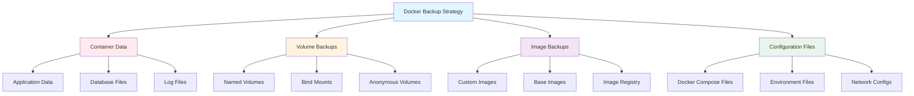

# 🐳 Docker Container Backup Strategy


## 📋 Overview

This guide provides comprehensive backup procedures for Docker containers, volumes, images, and configurations across our homelab infrastructure, implementing the 3-2-1 backup strategy for containerized applications.

## 🏗️ Docker Infrastructure

### 🖥️ Docker Hosts

#### PVE1 Docker Host
```yaml
Host: pve1.homelab.local
Docker Version: 24.0.x
Storage Driver: overlay2
Data Root: /var/lib/docker
Containers: 15+ production services
Volumes: 25+ persistent volumes
Networks: Custom bridge networks
```

#### PVE2 Docker Host  
```yaml
Host: pve2.homelab.local
Docker Version: 24.0.x
Storage Driver: overlay2
Data Root: /var/lib/docker
Containers: 12+ development services
Volumes: 20+ persistent volumes
Networks: Custom bridge networks
```

#### Synology NAS Docker
```yaml
Host: nas.homelab.local
Docker Version: 20.10.x (DSM)
Storage: Volume1 (/volume1/docker)
Containers: 8+ utility services
Volumes: Synology volume management
Networks: Synology Docker network
```

## 🔄 Backup Strategy

### 📊 Docker Backup Components



### 📅 Backup Schedule

| **Component** | **Frequency** | **Method** | **Retention** | **Storage** |
|---------------|---------------|------------|---------------|-------------|
| **Volume Data** | Daily | Volume export | 30 days | Local + NAS |
| **Container State** | Pre-update | Container commit | 7 days | Local |
| **Compose Files** | On change | Git + file copy | 90 days | Git + NAS |
| **Custom Images** | Weekly | Image export | 4 weeks | Registry + NAS |
| **Database Volumes** | Every 6 hours | Volume + dump | 48 hours | NAS + Cloud |

## 🛠️ Volume Backup Procedures

### 📦 Named Volume Backup
```bash
#!/bin/bash
# Docker volume backup script

BACKUP_DIR="/backup/docker/volumes/$(date +%Y%m%d)"
LOG_FILE="/var/log/docker-backup.log"

# Logging function
log_message() {
    echo "$(date '+%Y-%m-%d %H:%M:%S') - $1" | tee -a $LOG_FILE
}

# Backup single volume
backup_volume() {
    local volume_name=$1
    local backup_file="$BACKUP_DIR/${volume_name}_$(date +%Y%m%d_%H%M%S).tar.gz"
    
    log_message "Backing up volume: $volume_name"
    
    # Create backup directory
    mkdir -p "$BACKUP_DIR"
    
    # Create temporary container to access volume
    docker run --rm \
        -v "$volume_name":/data:ro \
        -v "$BACKUP_DIR":/backup \
        alpine:latest \
        tar -czf "/backup/$(basename "$backup_file")" -C /data .
    
    if [ $? -eq 0 ]; then
        log_message "Successfully backed up volume: $volume_name"
        
        # Generate checksum
        cd "$BACKUP_DIR"
        sha256sum "$(basename "$backup_file")" > "${backup_file}.sha256"
        
        return 0
    else
        log_message "Failed to backup volume: $volume_name"
        return 1
    fi
}

# Backup all volumes
backup_all_volumes() {
    log_message "Starting backup of all Docker volumes..."
    
    # Get list of all volumes
    local volumes=$(docker volume ls -q)
    local failed_backups=0
    
    for volume in $volumes; do
        if ! backup_volume "$volume"; then
            failed_backups=$((failed_backups + 1))
        fi
    done
    
    if [ $failed_backups -eq 0 ]; then
        log_message "All volume backups completed successfully"
    else
        log_message "Warning: $failed_backups volume backups failed"
    fi
}

# Restore volume from backup
restore_volume() {
    local volume_name=$1
    local backup_file=$2
    
    log_message "Restoring volume: $volume_name from $backup_file"
    
    # Verify backup file exists
    if [ ! -f "$backup_file" ]; then
        log_message "Error: Backup file not found: $backup_file"
        return 1
    fi
    
    # Verify checksum if available
    if [ -f "${backup_file}.sha256" ]; then
        cd "$(dirname "$backup_file")"
        if ! sha256sum -c "$(basename "${backup_file}.sha256")"; then
            log_message "Error: Backup file checksum verification failed"
            return 1
        fi
    fi
    
    # Create volume if it doesn't exist
    docker volume create "$volume_name"
    
    # Restore data to volume
    docker run --rm \
        -v "$volume_name":/data \
        -v "$(dirname "$backup_file")":/backup \
        alpine:latest \
        tar -xzf "/backup/$(basename "$backup_file")" -C /data
    
    if [ $? -eq 0 ]; then
        log_message "Successfully restored volume: $volume_name"
        return 0
    else
        log_message "Failed to restore volume: $volume_name"
        return 1
    fi
}

# Main execution
case "$1" in
    "backup")
        if [ -n "$2" ]; then
            backup_volume "$2"
        else
            backup_all_volumes
        fi
        ;;
    "restore")
        if [ -n "$2" ] && [ -n "$3" ]; then
            restore_volume "$2" "$3"
        else
            echo "Usage: $0 restore <volume_name> <backup_file>"
            exit 1
        fi
        ;;
    *)
        echo "Usage: $0 {backup [volume_name]|restore <volume_name> <backup_file>}"
        exit 1
        ;;
esac
```

### 🗂️ Bind Mount Backup
```bash
#!/bin/bash
# Bind mount backup script

BACKUP_DIR="/backup/docker/bind-mounts/$(date +%Y%m%d)"
LOG_FILE="/var/log/docker-bind-backup.log"

# Common bind mount paths
BIND_MOUNTS=(
    "/opt/docker/pihole"
    "/opt/docker/prometheus"
    "/opt/docker/grafana"
    "/opt/docker/homarr"
    "/opt/docker/trillium"
    "/opt/docker/jenkins"
)

# Backup bind mounts
backup_bind_mounts() {
    log_message "Starting backup of Docker bind mounts..."
    
    mkdir -p "$BACKUP_DIR"
    
    for mount_path in "${BIND_MOUNTS[@]}"; do
        if [ -d "$mount_path" ]; then
            local mount_name=$(basename "$mount_path")
            local backup_file="$BACKUP_DIR/${mount_name}_$(date +%Y%m%d_%H%M%S).tar.gz"
            
            log_message "Backing up bind mount: $mount_path"
            
            # Create backup with exclusions
            tar --exclude='*.log' \
                --exclude='tmp/*' \
                --exclude='cache/*' \
                -czf "$backup_file" \
                -C "$(dirname "$mount_path")" \
                "$(basename "$mount_path")"
            
            if [ $? -eq 0 ]; then
                log_message "Successfully backed up: $mount_path"
                
                # Generate checksum
                cd "$BACKUP_DIR"
                sha256sum "$(basename "$backup_file")" > "${backup_file}.sha256"
            else
                log_message "Failed to backup: $mount_path"
            fi
        else
            log_message "Warning: Mount path not found: $mount_path"
        fi
    done
}

backup_bind_mounts
```

## 🏃‍♂️ Container State Backup

### 📸 Container Snapshots
```bash
#!/bin/bash
# Container state backup script

BACKUP_DIR="/backup/docker/containers/$(date +%Y%m%d)"
LOG_FILE="/var/log/docker-container-backup.log"

# Create container snapshot
create_container_snapshot() {
    local container_name=$1
    local snapshot_name="${container_name}_snapshot_$(date +%Y%m%d_%H%M%S)"
    
    log_message "Creating snapshot of container: $container_name"
    
    # Check if container exists and is running
    if ! docker ps -q -f name="$container_name" | grep -q .; then
        log_message "Warning: Container $container_name is not running"
        return 1
    fi
    
    # Create container image from running container
    docker commit "$container_name" "$snapshot_name"
    
    if [ $? -eq 0 ]; then
        log_message "Container snapshot created: $snapshot_name"
        
        # Export image to file
        mkdir -p "$BACKUP_DIR"
        docker save "$snapshot_name" | gzip > "$BACKUP_DIR/${snapshot_name}.tar.gz"
        
        # Remove temporary image
        docker rmi "$snapshot_name"
        
        return 0
    else
        log_message "Failed to create snapshot for: $container_name"
        return 1
    fi
}

# Backup all running containers
backup_all_containers() {
    log_message "Starting container state backup..."
    
    # Get list of running containers
    local containers=$(docker ps --format "{{.Names}}")
    
    for container in $containers; do
        create_container_snapshot "$container"
    done
}

backup_all_containers
```

### 🔄 Container Configuration Backup
```bash
#!/bin/bash
# Container configuration backup script

BACKUP_DIR="/backup/docker/configs/$(date +%Y%m%d)"
LOG_FILE="/var/log/docker-config-backup.log"

# Export container configurations
backup_container_configs() {
    log_message "Starting container configuration backup..."
    
    mkdir -p "$BACKUP_DIR"
    
    # Export all container configurations
    docker ps -a --format "{{.Names}}" | while read container; do
        log_message "Exporting configuration for: $container"
        
        # Get container configuration
        docker inspect "$container" > "$BACKUP_DIR/${container}_config.json"
        
        # Get container environment variables
        docker exec "$container" env > "$BACKUP_DIR/${container}_env.txt" 2>/dev/null || true
        
        # Get container resource usage
        docker stats "$container" --no-stream --format "table {{.Container}}\t{{.CPUPerc}}\t{{.MemUsage}}\t{{.NetIO}}\t{{.BlockIO}}" > "$BACKUP_DIR/${container}_stats.txt" 2>/dev/null || true
    done
    
    # Export Docker system information
    docker system info > "$BACKUP_DIR/docker_system_info.txt"
    docker version > "$BACKUP_DIR/docker_version.txt"
    
    # Export network configurations
    docker network ls --format "{{.Name}}" | while read network; do
        if [ "$network" != "bridge" ] && [ "$network" != "host" ] && [ "$network" != "none" ]; then
            docker network inspect "$network" > "$BACKUP_DIR/network_${network}.json"
        fi
    done
    
    log_message "Container configuration backup completed"
}

backup_container_configs
```

## 🖼️ Image Management & Backup

### 📦 Custom Image Backup
```bash
#!/bin/bash
# Docker image backup script

BACKUP_DIR="/backup/docker/images/$(date +%Y%m%d)"
LOG_FILE="/var/log/docker-image-backup.log"
IMAGE_REGISTRY="registry.homelab.local:5000"

# Backup custom images
backup_custom_images() {
    log_message "Starting custom image backup..."
    
    mkdir -p "$BACKUP_DIR"
    
    # Get list of custom images (non-official)
    local custom_images=$(docker images --format "{{.Repository}}:{{.Tag}}" | grep -E "(homelab|custom|local)" | grep -v "<none>")
    
    for image in $custom_images; do
        local image_file=$(echo "$image" | tr '/' '_' | tr ':' '_')
        local backup_file="$BACKUP_DIR/${image_file}.tar.gz"
        
        log_message "Backing up image: $image"
        
        # Export image
        docker save "$image" | gzip > "$backup_file"
        
        if [ $? -eq 0 ]; then
            log_message "Successfully backed up image: $image"
            
            # Generate checksum
            cd "$BACKUP_DIR"
            sha256sum "$(basename "$backup_file")" > "${backup_file}.sha256"
            
            # Push to registry if available
            if docker info | grep -q "Registry:"; then
                docker tag "$image" "$IMAGE_REGISTRY/backup/$image"
                docker push "$IMAGE_REGISTRY/backup/$image"
            fi
        else
            log_message "Failed to backup image: $image"
        fi
    done
}

# Restore image from backup
restore_image() {
    local backup_file=$1
    
    log_message "Restoring image from: $backup_file"
    
    if [ ! -f "$backup_file" ]; then
        log_message "Error: Backup file not found: $backup_file"
        return 1
    fi
    
    # Verify checksum
    if [ -f "${backup_file}.sha256" ]; then
        cd "$(dirname "$backup_file")"
        if ! sha256sum -c "$(basename "${backup_file}.sha256")"; then
            log_message "Error: Image backup checksum verification failed"
            return 1
        fi
    fi
    
    # Load image
    gunzip -c "$backup_file" | docker load
    
    if [ $? -eq 0 ]; then
        log_message "Successfully restored image from: $backup_file"
        return 0
    else
        log_message "Failed to restore image from: $backup_file"
        return 1
    fi
}

case "$1" in
    "backup")
        backup_custom_images
        ;;
    "restore")
        if [ -n "$2" ]; then
            restore_image "$2"
        else
            echo "Usage: $0 restore <backup_file>"
            exit 1
        fi
        ;;
    *)
        echo "Usage: $0 {backup|restore <backup_file>}"
        exit 1
        ;;
esac
```

## 📋 Docker Compose Backup

### 🔧 Compose File Management
```bash
#!/bin/bash
# Docker Compose backup script

COMPOSE_DIRS=(
    "/opt/docker/pve1"
    "/opt/docker/pve2"
    "/opt/docker/nas"
)

BACKUP_DIR="/backup/docker/compose/$(date +%Y%m%d)"
LOG_FILE="/var/log/docker-compose-backup.log"

# Backup Docker Compose configurations
backup_compose_configs() {
    log_message "Starting Docker Compose configuration backup..."
    
    mkdir -p "$BACKUP_DIR"
    
    for compose_dir in "${COMPOSE_DIRS[@]}"; do
        if [ -d "$compose_dir" ]; then
            local dir_name=$(basename "$compose_dir")
            local backup_file="$BACKUP_DIR/compose_${dir_name}_$(date +%Y%m%d_%H%M%S).tar.gz"
            
            log_message "Backing up compose directory: $compose_dir"
            
            # Create backup including all compose files and configs
            tar -czf "$backup_file" \
                -C "$(dirname "$compose_dir")" \
                --exclude='*/data/*' \
                --exclude='*/logs/*' \
                --exclude='*/cache/*' \
                "$(basename "$compose_dir")"
            
            if [ $? -eq 0 ]; then
                log_message "Successfully backed up: $compose_dir"
                
                # Generate checksum
                cd "$BACKUP_DIR"
                sha256sum "$(basename "$backup_file")" > "${backup_file}.sha256"
                
                # Create service inventory
                find "$compose_dir" -name "docker-compose.yml" -o -name "compose.yml" | while read compose_file; do
                    echo "=== $(basename "$(dirname "$compose_file")") ===" >> "$BACKUP_DIR/service_inventory.txt"
                    grep -E "image:|container_name:" "$compose_file" >> "$BACKUP_DIR/service_inventory.txt"
                    echo "" >> "$BACKUP_DIR/service_inventory.txt"
                done
            else
                log_message "Failed to backup: $compose_dir"
            fi
        else
            log_message "Warning: Compose directory not found: $compose_dir"
        fi
    done
    
    log_message "Docker Compose backup completed"
}

# Backup running services state
backup_compose_services() {
    log_message "Backing up running Docker Compose services..."
    
    for compose_dir in "${COMPOSE_DIRS[@]}"; do
        if [ -d "$compose_dir" ]; then
            find "$compose_dir" -name "docker-compose.yml" -o -name "compose.yml" | while read compose_file; do
                local service_dir=$(dirname "$compose_file")
                local service_name=$(basename "$service_dir")
                
                cd "$service_dir"
                
                # Get service status
                docker-compose ps > "$BACKUP_DIR/${service_name}_status.txt" 2>/dev/null || docker compose ps > "$BACKUP_DIR/${service_name}_status.txt" 2>/dev/null
                
                # Get service logs (last 100 lines)
                docker-compose logs --tail=100 > "$BACKUP_DIR/${service_name}_logs.txt" 2>/dev/null || docker compose logs --tail=100 > "$BACKUP_DIR/${service_name}_logs.txt" 2>/dev/null
            done
        fi
    done
}

backup_compose_configs
backup_compose_services
```

## 🔄 Automated Backup Integration

### 📅 Master Docker Backup Script
```bash
#!/bin/bash
# Master Docker backup script

source /usr/local/bin/backup/master/backup-config.conf
source /usr/local/bin/backup/master/backup-functions.sh

DOCKER_BACKUP_DIR="/backup/docker/$(date +%Y%m%d)"

# Pre-backup preparations
prepare_docker_backup() {
    log_message "INFO" "Preparing Docker backup environment..."
    
    # Create backup directories
    mkdir -p "$DOCKER_BACKUP_DIR"/{volumes,containers,images,compose,configs}
    
    # Stop non-critical services for consistent backup
    local non_critical_services=("test-" "dev-" "staging-")
    
    for service_pattern in "${non_critical_services[@]}"; do
        docker ps --format "{{.Names}}" | grep "^$service_pattern" | while read container; do
            log_message "INFO" "Stopping non-critical service: $container"
            docker stop "$container"
        done
    done
}

# Execute Docker backup components
execute_docker_backup() {
    log_message "INFO" "Starting Docker backup execution..."
    
    # Backup volumes
    /usr/local/bin/backup/docker/volume-backup.sh backup
    
    # Backup bind mounts
    /usr/local/bin/backup/docker/bind-mount-backup.sh
    
    # Backup container configurations
    /usr/local/bin/backup/docker/config-backup.sh
    
    # Backup Docker Compose files
    /usr/local/bin/backup/docker/compose-backup.sh
    
    # Backup custom images (weekly only)
    if [ $(date +%u) -eq 7 ]; then
        /usr/local/bin/backup/docker/image-backup.sh backup
    fi
}

# Post-backup cleanup
cleanup_docker_backup() {
    log_message "INFO" "Performing Docker backup cleanup..."
    
    # Restart stopped services
    docker ps -a --filter "status=exited" --format "{{.Names}}" | while read container; do
        if docker ps -a --filter "name=$container" --format "{{.Status}}" | grep -q "Exited"; then
            log_message "INFO" "Restarting service: $container"
            docker start "$container"
        fi
    done
    
    # Clean up old images and containers
    docker system prune -f --volumes --filter "until=24h"
    
    # Compress daily backup
    tar -czf "$DOCKER_BACKUP_DIR.tar.gz" -C "/backup/docker" "$(date +%Y%m%d)"
    rm -rf "$DOCKER_BACKUP_DIR"
}

# Main execution
main() {
    log_message "INFO" "=== Starting Docker Backup Process ==="
    
    prepare_docker_backup
    execute_docker_backup
    cleanup_docker_backup
    
    log_message "SUCCESS" "=== Docker Backup Process Completed ==="
}

main "$@"
```

## 📊 Monitoring & Metrics

### 📈 Docker Backup Monitoring
```bash
#!/bin/bash
# Docker backup monitoring script

source /usr/local/bin/backup/master/backup-config.conf

# Monitor Docker backup status
monitor_docker_backups() {
    local backup_date=$(date +%Y%m%d)
    local backup_status=1
    local failed_components=""
    
    # Check volume backups
    if ! find "/backup/docker" -name "*volumes*$backup_date*" -type f | grep -q .; then
        backup_status=0
        failed_components="${failed_components},volumes"
    fi
    
    # Check compose backups
    if ! find "/backup/docker" -name "*compose*$backup_date*" -type f | grep -q .; then
        backup_status=0
        failed_components="${failed_components},compose"
    fi
    
    # Check config backups
    if ! find "/backup/docker" -name "*config*$backup_date*" -type f | grep -q .; then
        backup_status=0
        failed_components="${failed_components},configs"
    fi
    
    # Send metrics
    send_metric "docker_backup_success" "$backup_status" "{job=\"docker_backup\"}"
    
    # Send alert if failed
    if [ $backup_status -eq 0 ]; then
        send_notification "ERROR" "Docker Backup Failed" "Failed components: $failed_components"
    fi
    
    # Monitor Docker daemon health
    if docker info >/dev/null 2>&1; then
        send_metric "docker_daemon_healthy" "1" "{host=\"$(hostname)\"}"
    else
        send_metric "docker_daemon_healthy" "0" "{host=\"$(hostname)\"}"
        send_notification "ERROR" "Docker Daemon Unhealthy" "Docker daemon is not responding on $(hostname)"
    fi
    
    # Monitor volume usage
    docker system df --format "table {{.Type}}\t{{.Total}}\t{{.Active}}\t{{.Size}}\t{{.Reclaimable}}" | tail -n +2 | while read line; do
        local type=$(echo "$line" | awk '{print $1}')
        local size=$(echo "$line" | awk '{print $4}' | sed 's/[^0-9.]//g')
        
        if [ -n "$size" ]; then
            send_metric "docker_storage_usage_bytes" "$size" "{type=\"$type\",host=\"$(hostname)\"}"
        fi
    done
}

monitor_docker_backups
```

## 🧪 Recovery Testing

### 🔬 Docker Recovery Test Suite
```bash
#!/bin/bash
# Docker recovery testing script

source /usr/local/bin/backup/master/backup-functions.sh

TEST_DIR="/tmp/docker_recovery_test"
LOG_FILE="/var/log/docker-recovery-test.log"

# Test volume recovery
test_volume_recovery() {
    local test_volume="test_recovery_volume"
    local test_data="Docker recovery test - $(date)"
    
    log_message "INFO" "Testing volume recovery..."
    
    # Create test volume with data
    docker volume create "$test_volume"
    docker run --rm -v "$test_volume":/data alpine:latest sh -c "echo '$test_data' > /data/test.txt"
    
    # Backup the test volume
    local backup_file="$TEST_DIR/${test_volume}_test.tar.gz"
    docker run --rm -v "$test_volume":/data:ro -v "$TEST_DIR":/backup alpine:latest tar -czf "/backup/$(basename "$backup_file")" -C /data .
    
    # Remove original volume
    docker volume rm "$test_volume"
    
    # Restore volume
    docker volume create "$test_volume"
    docker run --rm -v "$test_volume":/data -v "$TEST_DIR":/backup alpine:latest tar -xzf "/backup/$(basename "$backup_file")" -C /data
    
    # Verify restored data
    local restored_data=$(docker run --rm -v "$test_volume":/data alpine:latest cat /data/test.txt)
    
    if [ "$restored_data" = "$test_data" ]; then
        log_message "SUCCESS" "Volume recovery test passed"
        docker volume rm "$test_volume"
        return 0
    else
        log_message "ERROR" "Volume recovery test failed"
        docker volume rm "$test_volume"
        return 1
    fi
}

# Test container recovery
test_container_recovery() {
    local test_container="test_recovery_container"
    local test_image="alpine:latest"
    
    log_message "INFO" "Testing container recovery..."
    
    # Create and modify container
    docker run -d --name "$test_container" "$test_image" sleep 3600
    docker exec "$test_container" sh -c "echo 'Recovery test' > /tmp/test.txt"
    
    # Create snapshot
    local snapshot_image="${test_container}_snapshot"
    docker commit "$test_container" "$snapshot_image"
    
    # Remove original container
    docker stop "$test_container"
    docker rm "$test_container"
    
    # Restore from snapshot
    docker run -d --name "$test_container" "$snapshot_image" sleep 3600
    
    # Verify data
    local test_result=$(docker exec "$test_container" cat /tmp/test.txt 2>/dev/null)
    
    if [ "$test_result" = "Recovery test" ]; then
        log_message "SUCCESS" "Container recovery test passed"
        docker stop "$test_container"
        docker rm "$test_container"
        docker rmi "$snapshot_image"
        return 0
    else
        log_message "ERROR" "Container recovery test failed"
        docker stop "$test_container" 2>/dev/null || true
        docker rm "$test_container" 2>/dev/null || true
        docker rmi "$snapshot_image" 2>/dev/null || true
        return 1
    fi
}

# Main testing function
main() {
    log_message "INFO" "=== Starting Docker Recovery Tests ==="
    
    # Prepare test environment
    mkdir -p "$TEST_DIR"
    
    # Run tests
    local test_failures=0
    
    if ! test_volume_recovery; then
        test_failures=$((test_failures + 1))
    fi
    
    if ! test_container_recovery; then
        test_failures=$((test_failures + 1))
    fi
    
    # Cleanup
    rm -rf "$TEST_DIR"
    
    # Report results
    if [ $test_failures -eq 0 ]; then
        log_message "SUCCESS" "All Docker recovery tests passed"
        return 0
    else
        log_message "ERROR" "$test_failures Docker recovery tests failed"
        return 1
    fi
}

main "$@"
```

---

## 🔗 Related Documentation

- [📋 Main Backup Strategy](../) - Overall backup strategy
- [🖥️ Proxmox Backups](../proxmox/) - VM and container backups
- [💾 Database Backups](../databases/) - Database-specific backups
- [📱 Application Backups](../applications/) - Application backup procedures
- [🔧 Backup Scripts](../scripts/) - Automation scripts and utilities

---

**⚠️ Important Notes**:
- Always test container restoration procedures before production use
- Monitor Docker daemon health and storage usage regularly
- Keep Docker Compose files under version control
- Consider using Docker registries for image backup redundancy
- Implement proper secrets management for sensitive container data
