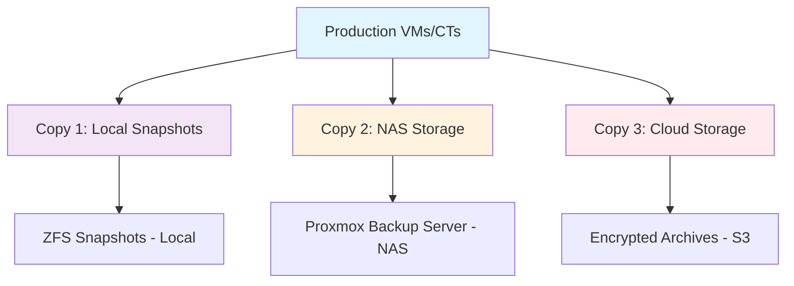

# 🖥️ Proxmox VE Backup Strategy


## 📋 Overview

This guide provides comprehensive backup procedures for Proxmox Virtual Environment (VE), covering virtual machines, containers, configurations, and cluster settings following the 3-2-1 backup strategy.

## 🏗️ Proxmox Infrastructure

### 🖥️ Host Configuration

#### Primary Host (pve1)

```yaml
Hardware:
  Model: Dell OptiPlex 7040 SFF
  CPU: Intel i5-6500 (4C/4T)
  RAM: 32GB DDR4
  Storage:
    - 1TB NVMe SSD (local-lvm)
    - 2TB HDD (local-zfs)
  Network: 1GbE

Proxmox Version: 7.x
Node ID: pve1
Cluster: homelab-cluster
```

#### Secondary Host (pve2)

```yaml
Hardware:
  Model: Dell OptiPlex 7040 SFF
  CPU: Intel i5-6500 (4C/4T)
  RAM: 32GB DDR4
  Storage:
    - 1TB NVMe SSD (local-lvm)
    - 2TB HDD (local-zfs)
  Network: 1GbE

Proxmox Version: 7.x
Node ID: pve2
Cluster: homelab-cluster
```

## 🔄 Backup Strategy Overview

### 📊 3-2-1 Implementation for Proxmox



### 📅 Backup Schedule

| **Type** | **Frequency** | **Retention** | **Storage** | **Purpose** |
|----------|---------------|---------------|-------------|-------------|
| **ZFS Snapshots** | Every 15 min | 24 hours | Local ZFS | Quick recovery |
| **VM Snapshots** | Hourly | 48 hours | Local storage | Point-in-time |
| **Full Backups** | Daily | 30 days | NAS (PBS) | Complete restore |
| **Archive Backups** | Weekly | 12 weeks | Cloud storage | Disaster recovery |
| **Configuration** | Daily | 90 days | Multiple locations | System rebuild |

## 🛠️ Backup Tools & Methods

### 

#### Installation & Configuration
```bash
# Install Proxmox Backup Server on Synology NAS
# Using Docker container approach

version: '3.8'
services:
  proxmox-backup:
    image: proxmox/proxmox-backup-server:latest
    container_name: pbs
    privileged: true
    ports:
      - "8007:8007"
    volumes:
      - ./pbs-data:/var/lib/proxmox-backup
      - ./pbs-config:/etc/proxmox-backup
    environment:
      - PBS_ROOT_PASSWORD=secure_password
    restart: unless-stopped
```

#### Datastore Configuration
```bash
# Create datastore on PBS
proxmox-backup-manager datastore create homelab-vms /backup/vms
proxmox-backup-manager datastore create homelab-cts /backup/containers
proxmox-backup-manager datastore create homelab-config /backup/config
```

### 

#### Automated ZFS Snapshots
```bash
#!/bin/bash
# /usr/local/bin/zfs-snapshot.sh

# Configuration
POOLS=("rpool" "tank")
RETENTION_HOURLY=24
RETENTION_DAILY=7
RETENTION_WEEKLY=4

# Function to create snapshots
create_snapshot() {
    local pool=$1
    local frequency=$2
    local timestamp=$(date +%Y%m%d_%H%M%S)
    
    # Create snapshot
    zfs snapshot ${pool}@auto_${frequency}_${timestamp}
    
    # Log the operation
    echo "$(date): Created snapshot ${pool}@auto_${frequency}_${timestamp}" >> /var/log/zfs-snapshots.log
}

# Cleanup old snapshots
cleanup_snapshots() {
    local pool=$1
    local frequency=$2
    local retention=$3
    
    # List and delete old snapshots
    zfs list -H -t snapshot -o name -S creation ${pool} | \
    grep "auto_${frequency}" | \
    tail -n +$((retention + 1)) | \
    xargs -I {} zfs destroy {}
}

# Main execution
for pool in "${POOLS[@]}"; do
    create_snapshot $pool "hourly"
    cleanup_snapshots $pool "hourly" $RETENTION_HOURLY
done
```

### 

#### Vzdump Configuration
```bash
# /etc/vzdump.conf
tmpdir: /var/tmp
dumpdir: /var/lib/vz/dump
storage: local
mode: snapshot
compress: zstd
pigz: 1
lockwait: 60
stopwait: 300
ionice: 7
bandwidth: 100000
```

#### Custom Backup Script
```bash
#!/bin/bash
# /usr/local/bin/proxmox-backup.sh

# Configuration
BACKUP_STORAGE="pbs:homelab-vms"
LOG_FILE="/var/log/proxmox-backup.log"
NOTIFICATION_EMAIL="admin@homelab.local"
RETENTION_DAYS=30

# Logging function
log_message() {
    echo "$(date '+%Y-%m-%d %H:%M:%S') - $1" | tee -a $LOG_FILE
}

# Error handling
handle_error() {
    log_message "ERROR: $1"
    echo "Backup failed: $1" | mail -s "Proxmox Backup Failed" $NOTIFICATION_EMAIL
    exit 1
}

# Pre-backup checks
pre_backup_checks() {
    log_message "Starting pre-backup checks..."
    
    # Check storage space
    if ! df -h | grep -q "/var/lib/vz"; then
        handle_error "Backup storage not available"
    fi
    
    # Check PBS connectivity
    if ! ping -c 1 pbs.homelab.local >/dev/null 2>&1; then
        handle_error "Cannot reach Proxmox Backup Server"
    fi
    
    log_message "Pre-backup checks completed successfully"
}

# Backup VMs
backup_vms() {
    log_message "Starting VM backups..."
    
    # Get list of running VMs
    VM_LIST=$(qm list | awk 'NR>1 {print $1}')
    
    for vmid in $VM_LIST; do
        log_message "Backing up VM $vmid..."
        
        if vzdump $vmid --storage $BACKUP_STORAGE --compress zstd --mode snapshot; then
            log_message "Successfully backed up VM $vmid"
        else
            log_message "Failed to backup VM $vmid"
        fi
    done
}

# Backup containers
backup_containers() {
    log_message "Starting container backups..."
    
    # Get list of containers
    CT_LIST=$(pct list | awk 'NR>1 {print $1}')
    
    for ctid in $CT_LIST; do
        log_message "Backing up container $ctid..."
        
        if vzdump $ctid --storage $BACKUP_STORAGE --compress zstd --mode snapshot; then
            log_message "Successfully backed up container $ctid"
        else
            log_message "Failed to backup container $ctid"
        fi
    done
}

# Backup configurations
backup_configs() {
    log_message "Starting configuration backup..."
    
    # Create config backup directory
    CONFIG_BACKUP="/tmp/proxmox-config-$(date +%Y%m%d)"
    mkdir -p $CONFIG_BACKUP
    
    # Backup important configurations
    cp -r /etc/pve $CONFIG_BACKUP/
    cp -r /etc/network $CONFIG_BACKUP/
    cp /etc/hosts $CONFIG_BACKUP/
    cp /etc/hostname $CONFIG_BACKUP/
    
    # Create archive
    tar -czf $CONFIG_BACKUP.tar.gz -C /tmp proxmox-config-$(date +%Y%m%d)
    
    # Move to backup storage
    mv $CONFIG_BACKUP.tar.gz /var/lib/vz/dump/
    
    # Cleanup
    rm -rf $CONFIG_BACKUP
    
    log_message "Configuration backup completed"
}

# Cleanup old backups
cleanup_old_backups() {
    log_message "Cleaning up old backups..."
    
    # Find and remove backups older than retention period
    find /var/lib/vz/dump -name "*.tar.gz" -mtime +$RETENTION_DAYS -delete
    find /var/lib/vz/dump -name "*.vma.zst" -mtime +$RETENTION_DAYS -delete
    
    log_message "Cleanup completed"
}

# Post-backup verification
post_backup_verification() {
    log_message "Starting post-backup verification..."
    
    # Check backup files
    BACKUP_COUNT=$(find /var/lib/vz/dump -name "*$(date +%Y_%m_%d)*" | wc -l)
    
    if [ $BACKUP_COUNT -gt 0 ]; then
        log_message "Found $BACKUP_COUNT backup files created today"
        echo "Backup completed successfully. $BACKUP_COUNT files created." | \
        mail -s "Proxmox Backup Successful" $NOTIFICATION_EMAIL
    else
        handle_error "No backup files found for today"
    fi
}

# Main execution
main() {
    log_message "=== Starting Proxmox Backup Process ==="
    
    pre_backup_checks
    backup_vms
    backup_containers
    backup_configs
    cleanup_old_backups
    post_backup_verification
    
    log_message "=== Backup Process Completed ==="
}

# Execute main function
main "$@"
```

## 📊 Backup Types & Procedures

### 🔄 VM Snapshots
```bash
# Create VM snapshot
qm snapshot 100 before-update

# List snapshots
qm listsnapshot 100

# Rollback to snapshot
qm rollback 100 before-update

# Delete snapshot
qm delsnapshot 100 before-update
```

### 📦 Full VM Backups
```bash
# Backup single VM
vzdump 100 --storage local --compress zstd --mode snapshot

# Backup all VMs
vzdump --all 1 --storage pbs:homelab-vms --compress zstd --mode snapshot

# Backup specific VMs
vzdump 100,101,102 --storage pbs:homelab-vms --compress zstd
```

### 🐳 Container Backups
```bash
# Backup single container
vzdump 200 --storage local --compress zstd --mode snapshot

# Backup all containers
vzdump --all 0 --storage pbs:homelab-cts --compress zstd --mode snapshot

# Backup with exclusions
vzdump --all 0 --exclude-path /tmp --exclude-path /var/log
```

### ⚙️ Configuration Backups
```bash
#!/bin/bash
# Backup Proxmox configurations

# Create backup directory
BACKUP_DIR="/backup/proxmox-config/$(date +%Y%m%d)"
mkdir -p $BACKUP_DIR

# Backup cluster configuration
cp -r /etc/pve $BACKUP_DIR/
cp -r /etc/network $BACKUP_DIR/
cp /etc/hosts $BACKUP_DIR/
cp /etc/hostname $BACKUP_DIR/

# Backup storage configuration
pvesm status > $BACKUP_DIR/storage-status.txt
pvesm list local > $BACKUP_DIR/local-storage.txt

# Backup user/permission configuration
pveum user list > $BACKUP_DIR/users.txt
pveum group list > $BACKUP_DIR/groups.txt
pveum acl list > $BACKUP_DIR/acl.txt

# Create compressed archive
tar -czf $BACKUP_DIR.tar.gz -C /backup/proxmox-config $(date +%Y%m%d)
rm -rf $BACKUP_DIR
```

## 🔧 Automation & Scheduling

### 📅 Cron Jobs
```bash
# /etc/crontab entries

# ZFS snapshots every 15 minutes
*/15 * * * * root /usr/local/bin/zfs-snapshot.sh

# VM snapshots hourly
0 * * * * root /usr/local/bin/vm-snapshot.sh

# Full backups daily at 2 AM
0 2 * * * root /usr/local/bin/proxmox-backup.sh

# Configuration backup daily at 3 AM
0 3 * * * root /usr/local/bin/config-backup.sh

# Cleanup old backups weekly
0 4 * * 0 root /usr/local/bin/backup-cleanup.sh
```

### 🔄 Systemd Services
```ini
# /etc/systemd/system/proxmox-backup.service
[Unit]
Description=Proxmox Backup Service
After=network.target

[Service]
Type=oneshot
ExecStart=/usr/local/bin/proxmox-backup.sh
User=root
StandardOutput=journal
StandardError=journal

[Install]
WantedBy=multi-user.target
```

```ini
# /etc/systemd/system/proxmox-backup.timer
[Unit]
Description=Run Proxmox Backup Daily
Requires=proxmox-backup.service

[Timer]
OnCalendar=daily
Persistent=true

[Install]
WantedBy=timers.target
```

## 📈 Monitoring & Alerting

### 📊 Backup Monitoring Script
```bash
#!/bin/bash
# /usr/local/bin/backup-monitor.sh

# Configuration
PROMETHEUS_PUSHGATEWAY="http://monitoring.homelab.local:9091"
ALERT_EMAIL="admin@homelab.local"
LOG_FILE="/var/log/backup-monitor.log"

# Check backup status
check_backup_status() {
    local job_name=$1
    local expected_files=$2
    local backup_path=$3
    
    # Count backup files from today
    file_count=$(find $backup_path -name "*$(date +%Y_%m_%d)*" -type f | wc -l)
    
    # Send metrics to Prometheus
    cat <<EOF | curl -X POST --data-binary @- $PROMETHEUS_PUSHGATEWAY/metrics/job/backup_monitor/instance/pve1
backup_files_created{job="$job_name"} $file_count
backup_expected_files{job="$job_name"} $expected_files
EOF
    
    # Alert if backup failed
    if [ $file_count -lt $expected_files ]; then
        echo "ALERT: $job_name backup incomplete. Expected: $expected_files, Found: $file_count" | \
        mail -s "Backup Alert: $job_name" $ALERT_EMAIL
    fi
}

# Monitor different backup jobs
check_backup_status "vm_backup" 5 "/var/lib/vz/dump"
check_backup_status "config_backup" 1 "/backup/proxmox-config"
```

### 🚨 Alert Configuration
```yaml
# Prometheus alerting rules
groups:
  - name: proxmox_backup
    rules:
      - alert: BackupJobFailed
        expr: backup_files_created < backup_expected_files
        for: 1h
        labels:
          severity: critical
        annotations:
          summary: "Proxmox backup job failed"
          description: "Backup job {{ $labels.job }} has failed to create expected backup files"
      
      - alert: BackupStorageFull
        expr: node_filesystem_avail_bytes{mountpoint="/var/lib/vz"} / node_filesystem_size_bytes{mountpoint="/var/lib/vz"} < 0.1
        for: 5m
        labels:
          severity: warning
        annotations:
          summary: "Backup storage running low"
          description: "Backup storage is {{ $value | humanizePercentage }} full"
```

## 🔄 Recovery Procedures

### 🚀 VM Recovery
```bash
# List available backups
pbs-client backup list --repository pbs@pbs.homelab.local:homelab-vms

# Restore VM from backup
qmrestore /var/lib/vz/dump/vzdump-qemu-100-2024_09_23-02_00_00.vma.zst 100

# Restore from Proxmox Backup Server
pbs-client restore vm/100/2024-09-23T02:00:00Z --repository pbs@pbs.homelab.local:homelab-vms
```

### 🐳 Container Recovery
```bash
# Restore container
pct restore 200 /var/lib/vz/dump/vzdump-lxc-200-2024_09_23-02_00_00.tar.zst

# Restore from PBS
pbs-client restore ct/200/2024-09-23T02:00:00Z --repository pbs@pbs.homelab.local:homelab-cts
```

### ⚙️ Configuration Recovery
```bash
# Restore Proxmox configuration
tar -xzf /backup/proxmox-config/20240923.tar.gz -C /

# Restart services
systemctl restart pve-cluster
systemctl restart pvedaemon
systemctl restart pveproxy
```

## 🧪 Testing & Validation

### 📋 Monthly Recovery Test
```bash
#!/bin/bash
# /usr/local/bin/recovery-test.sh

# Test VM restore
TEST_VMID=999
BACKUP_FILE=$(ls -t /var/lib/vz/dump/vzdump-qemu-100-*.vma.zst | head -1)

# Restore to test VM
qmrestore $BACKUP_FILE $TEST_VMID --unique

# Start and verify
qm start $TEST_VMID
sleep 60

# Check if VM is running
if qm status $TEST_VMID | grep -q "running"; then
    echo "Recovery test PASSED"
else
    echo "Recovery test FAILED"
fi

# Cleanup
qm stop $TEST_VMID
qm destroy $TEST_VMID
```

## 📊 Performance Optimization

### 🚀 Backup Performance Tuning
```bash
# Optimize vzdump performance
echo 'tmpdir: /tmp' >> /etc/vzdump.conf
echo 'pigz: 4' >> /etc/vzdump.conf
echo 'ionice: 3' >> /etc/vzdump.conf
echo 'bandwidth: 200000' >> /etc/vzdump.conf

# ZFS tuning for backups
echo 'zfs set compression=lz4 rpool' >> /etc/rc.local
echo 'zfs set recordsize=1M rpool' >> /etc/rc.local
```

## 📋 Maintenance Checklist

### 🔄 Daily Tasks
- [ ] Verify backup completion
- [ ] Check storage space
- [ ] Review backup logs
- [ ] Monitor performance

### 📅 Weekly Tasks
- [ ] Test sample restore
- [ ] Clean old snapshots
- [ ] Update backup scripts
- [ ] Review monitoring alerts

### 🗓️ Monthly Tasks
- [ ] Full recovery test
- [ ] Update documentation
- [ ] Review retention policies
- [ ] Performance analysis

## 📞 Emergency Contacts

### 🚨 Escalation Matrix
1. **Level 1**: System Administrator
2. **Level 2**: Infrastructure Team Lead  
3. **Level 3**: External Support Vendor

### 📱 Contact Information
```yaml
Emergency Contacts:
  Primary Admin:
    Name: "System Administrator"
    Phone: "+1-xxx-xxx-xxxx"
    Email: "admin@homelab.local"
  
  Backup Admin:
    Name: "Backup Administrator" 
    Phone: "+1-xxx-xxx-xxxx"
    Email: "backup@homelab.local"
    
  Vendor Support:
    Proxmox: "https://www.proxmox.com/en/support"
    Dell: "1-800-WWW-DELL"
```

---

## 🔗 Related Documentation

- [📋 Main Backup Strategy](../) - Overall backup strategy
- [🐳 Docker Backups](../docker/) - Container backup procedures
- [💾 Database Backups](../databases/) - Database-specific backups
- [🔧 Backup Scripts](../scripts/) - Automation scripts
- [🧪 Testing Procedures](../testing/) - Backup testing and validation

---

**⚠️ Critical Note**: Always test your backups regularly. A backup that cannot be restored is not a backup at all. Follow the 3-2-1 rule religiously and maintain proper documentation of all procedures.
