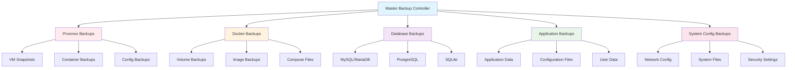

# 🔧 Backup Automation Scripts

 

## 📋 Overview

This section contains all automation scripts, monitoring tools, and procedures for implementing the 3-2-1 backup strategy across our homelab infrastructure. These scripts ensure consistent, reliable, and automated backup operations.

## 🏗️ Script Architecture



## 📂 Script Directory Structure

```bash
/usr/local/bin/backup/
├── master/
│   ├── master-backup.sh           # Main backup orchestrator
│   ├── backup-config.conf          # Global configuration
│   └── backup-functions.sh         # Common functions
├── proxmox/
│   ├── vm-backup.sh               # VM backup automation
│   ├── container-backup.sh        # LXC container backups
│   └── config-backup.sh           # Proxmox configuration
├── docker/
│   ├── docker-backup.sh           # Docker volume backups
│   ├── compose-backup.sh          # Docker Compose backups
│   └── image-backup.sh            # Docker image backups
├── databases/
│   ├── mysql-backup.sh            # MySQL/MariaDB backups
│   ├── postgres-backup.sh         # PostgreSQL backups
│   └── sqlite-backup.sh           # SQLite backups
├── applications/
│   ├── app-backup.sh              # Application-specific backups
│   └── config-backup.sh           # Application configurations
├── monitoring/
│   ├── backup-monitor.sh          # Backup monitoring
│   ├── alert-handler.sh           # Alert management
│   └── report-generator.sh        # Backup reports
└── utilities/
    ├── encryption.sh              # Backup encryption
    ├── compression.sh             # Backup compression
    └── cleanup.sh                 # Backup cleanup
```

## 🎯 Master Backup Controller

### 📋 Configuration File
```bash
#!/bin/bash
# /usr/local/bin/backup/master/backup-config.conf

# Global Backup Configuration
export BACKUP_ROOT="/backup"
export LOG_ROOT="/var/log/backup"
export TEMP_DIR="/tmp/backup"

# Retention Policies
export RETENTION_HOURLY=24
export RETENTION_DAILY=30
export RETENTION_WEEKLY=12
export RETENTION_MONTHLY=12

# Storage Locations
export LOCAL_STORAGE="/backup/local"
export NAS_STORAGE="/backup/nas"
export CLOUD_STORAGE="/backup/cloud"

# Encryption Settings
export ENCRYPTION_ENABLED=true
export ENCRYPTION_KEY_FILE="/etc/backup/encryption.key"
export COMPRESSION_LEVEL=6

# Notification Settings
export NOTIFICATION_EMAIL="admin@homelab.local"
export SLACK_WEBHOOK_URL="https://hooks.slack.com/services/YOUR/WEBHOOK/URL"
export PROMETHEUS_PUSHGATEWAY="http://monitoring.homelab.local:9091"

# Database Settings
export DB_BACKUP_USER="backup_user"
export DB_BACKUP_PASSWORD_FILE="/etc/backup/db_password"

# Cloud Storage Settings
export AWS_ACCESS_KEY_ID_FILE="/etc/backup/aws_access_key"
export AWS_SECRET_ACCESS_KEY_FILE="/etc/backup/aws_secret_key"
export AWS_DEFAULT_REGION="us-east-1"
export S3_BUCKET="homelab-backups"

# Application Settings
export DOCKER_SOCKET="/var/run/docker.sock"
export PROXMOX_API_URL="https://pve1.homelab.local:8006/api2/json"
export PROXMOX_TOKEN_FILE="/etc/backup/proxmox_token"
```

### 🔧 Common Functions Library
```bash
#!/bin/bash
# /usr/local/bin/backup/master/backup-functions.sh

# Source configuration
source /usr/local/bin/backup/master/backup-config.conf

# Logging function
log_message() {
    local level=$1
    local message=$2
    local timestamp=$(date '+%Y-%m-%d %H:%M:%S')
    local log_file="$LOG_ROOT/backup.log"
    
    # Ensure log directory exists
    mkdir -p "$LOG_ROOT"
    
    # Write to log file
    echo "[$timestamp] [$level] $message" >> "$log_file"
    
    # Also output to console if interactive
    if [ -t 1 ]; then
        case $level in
            ERROR)   echo -e "\033[31m[$timestamp] [$level] $message\033[0m" ;;
            WARNING) echo -e "\033[33m[$timestamp] [$level] $message\033[0m" ;;
            SUCCESS) echo -e "\033[32m[$timestamp] [$level] $message\033[0m" ;;
            *)       echo "[$timestamp] [$level] $message" ;;
        esac
    fi
}

# Error handling
handle_error() {
    local error_message=$1
    local exit_code=${2:-1}
    
    log_message "ERROR" "$error_message"
    send_notification "ERROR" "Backup Failed" "$error_message"
    exit $exit_code
}

# Success notification
handle_success() {
    local success_message=$1
    
    log_message "SUCCESS" "$success_message"
    send_notification "SUCCESS" "Backup Completed" "$success_message"
}

# Send notifications
send_notification() {
    local level=$1
    local subject=$2
    local message=$3
    
    # Email notification
    if [ -n "$NOTIFICATION_EMAIL" ]; then
        echo "$message" | mail -s "[$level] $subject" "$NOTIFICATION_EMAIL"
    fi
    
    # Slack notification
    if [ -n "$SLACK_WEBHOOK_URL" ]; then
        local color=""
        case $level in
            ERROR)   color="danger" ;;
            WARNING) color="warning" ;;
            SUCCESS) color="good" ;;
            *)       color="good" ;;
        esac
        
        curl -X POST -H 'Content-type: application/json' \
            --data "{\"attachments\":[{\"color\":\"$color\",\"title\":\"$subject\",\"text\":\"$message\"}]}" \
            "$SLACK_WEBHOOK_URL"
    fi
}

# Prometheus metrics
send_metric() {
    local metric_name=$1
    local metric_value=$2
    local labels=$3
    
    if [ -n "$PROMETHEUS_PUSHGATEWAY" ]; then
        cat <<EOF | curl -X POST --data-binary @- "$PROMETHEUS_PUSHGATEWAY/metrics/job/backup_system"
${metric_name}${labels} ${metric_value}
EOF
    fi
}

# Encryption function
encrypt_file() {
    local input_file=$1
    local output_file=$2
    
    if [ "$ENCRYPTION_ENABLED" = "true" ] && [ -f "$ENCRYPTION_KEY_FILE" ]; then
        openssl enc -aes-256-cbc -salt -in "$input_file" -out "$output_file" -pass file:"$ENCRYPTION_KEY_FILE"
        if [ $? -eq 0 ]; then
            log_message "INFO" "File encrypted successfully: $output_file"
            return 0
        else
            log_message "ERROR" "Failed to encrypt file: $input_file"
            return 1
        fi
    else
        cp "$input_file" "$output_file"
        return 0
    fi
}

# Compression function
compress_file() {
    local input_file=$1
    local output_file=$2
    local compression_level=${3:-$COMPRESSION_LEVEL}
    
    if command -v zstd >/dev/null 2>&1; then
        zstd -$compression_level "$input_file" -o "$output_file"
    elif command -v gzip >/dev/null 2>&1; then
        gzip -$compression_level -c "$input_file" > "$output_file"
    else
        cp "$input_file" "$output_file"
        log_message "WARNING" "No compression tool available, copying file as-is"
    fi
}

# Storage space check
check_storage_space() {
    local path=$1
    local required_space_gb=$2
    
    local available_space=$(df "$path" | awk 'NR==2 {print $4}')
    local available_space_gb=$((available_space / 1024 / 1024))
    
    if [ $available_space_gb -lt $required_space_gb ]; then
        log_message "ERROR" "Insufficient storage space. Required: ${required_space_gb}GB, Available: ${available_space_gb}GB"
        return 1
    else
        log_message "INFO" "Storage space check passed. Available: ${available_space_gb}GB"
        return 0
    fi
}

# Cleanup old backups
cleanup_old_backups() {
    local backup_path=$1
    local retention_days=$2
    local pattern=${3:-"*"}
    
    log_message "INFO" "Cleaning up backups older than $retention_days days in $backup_path"
    
    find "$backup_path" -name "$pattern" -type f -mtime +$retention_days -delete
    
    local deleted_count=$(find "$backup_path" -name "$pattern" -type f -mtime +$retention_days | wc -l)
    log_message "INFO" "Cleaned up $deleted_count old backup files"
}

# Verify backup integrity
verify_backup() {
    local backup_file=$1
    local verification_method=${2:-"checksum"}
    
    case $verification_method in
        "checksum")
            if [ -f "${backup_file}.sha256" ]; then
                cd "$(dirname "$backup_file")"
                if sha256sum -c "$(basename "${backup_file}.sha256")" >/dev/null 2>&1; then
                    log_message "SUCCESS" "Backup integrity verified: $backup_file"
                    return 0
                else
                    log_message "ERROR" "Backup integrity check failed: $backup_file"
                    return 1
                fi
            else
                log_message "WARNING" "No checksum file found for: $backup_file"
                return 1
            fi
            ;;
        "archive")
            if tar -tzf "$backup_file" >/dev/null 2>&1; then
                log_message "SUCCESS" "Archive integrity verified: $backup_file"
                return 0
            else
                log_message "ERROR" "Archive integrity check failed: $backup_file"
                return 1
            fi
            ;;
        *)
            log_message "WARNING" "Unknown verification method: $verification_method"
            return 1
            ;;
    esac
}

# Generate checksum
generate_checksum() {
    local file_path=$1
    local checksum_file="${file_path}.sha256"
    
    cd "$(dirname "$file_path")"
    sha256sum "$(basename "$file_path")" > "$checksum_file"
    
    if [ $? -eq 0 ]; then
        log_message "INFO" "Checksum generated: $checksum_file"
    else
        log_message "ERROR" "Failed to generate checksum for: $file_path"
    fi
}

# Cloud upload function
upload_to_cloud() {
    local local_file=$1
    local cloud_path=$2
    
    if command -v aws >/dev/null 2>&1; then
        aws s3 cp "$local_file" "s3://$S3_BUCKET/$cloud_path"
        if [ $? -eq 0 ]; then
            log_message "SUCCESS" "File uploaded to cloud: $cloud_path"
            return 0
        else
            log_message "ERROR" "Failed to upload file to cloud: $local_file"
            return 1
        fi
    else
        log_message "WARNING" "AWS CLI not available, skipping cloud upload"
        return 1
    fi
}

# Pre-backup checks
pre_backup_checks() {
    log_message "INFO" "Starting pre-backup checks..."
    
    # Check if running as root
    if [ "$EUID" -ne 0 ]; then
        handle_error "Backup script must be run as root"
    fi
    
    # Check storage space
    check_storage_space "$BACKUP_ROOT" 10 || handle_error "Insufficient storage space"
    
    # Check required directories
    for dir in "$BACKUP_ROOT" "$LOG_ROOT" "$TEMP_DIR"; do
        mkdir -p "$dir" || handle_error "Failed to create directory: $dir"
    done
    
    # Check required tools
    for tool in tar gzip openssl curl; do
        if ! command -v "$tool" >/dev/null 2>&1; then
            log_message "WARNING" "Required tool not found: $tool"
        fi
    done
    
    log_message "SUCCESS" "Pre-backup checks completed"
}

# Post-backup procedures
post_backup_procedures() {
    local backup_file=$1
    
    log_message "INFO" "Starting post-backup procedures..."
    
    # Generate checksum
    generate_checksum "$backup_file"
    
    # Verify backup
    verify_backup "$backup_file" "archive"
    
    # Upload to cloud if enabled
    if [ "$CLOUD_STORAGE_ENABLED" = "true" ]; then
        upload_to_cloud "$backup_file" "$(basename "$backup_file")"
    fi
    
    # Send metrics
    local backup_size=$(du -b "$backup_file" | cut -f1)
    send_metric "backup_size_bytes" "$backup_size" "{backup_type=\"$(basename "$backup_file" | cut -d'-' -f1)\"}"
    
    log_message "SUCCESS" "Post-backup procedures completed"
}
```

### 🎯 Master Backup Script
```bash
#!/bin/bash
# /usr/local/bin/backup/master/master-backup.sh

# Load configuration and functions
source /usr/local/bin/backup/master/backup-config.conf
source /usr/local/bin/backup/master/backup-functions.sh

# Script metadata
SCRIPT_NAME="Master Backup Controller"
SCRIPT_VERSION="2.0.0"
START_TIME=$(date +%s)

# Main backup orchestration
main() {
    log_message "INFO" "=== $SCRIPT_NAME v$SCRIPT_VERSION Started ==="
    
    # Pre-backup checks
    pre_backup_checks
    
    # Create daily backup directory
    local backup_date=$(date +%Y%m%d)
    local daily_backup_dir="$BACKUP_ROOT/$backup_date"
    mkdir -p "$daily_backup_dir"
    
    # Execute backup stages
    execute_backup_stage "proxmox" "Proxmox Infrastructure"
    execute_backup_stage "docker" "Docker Containers"
    execute_backup_stage "databases" "Database Systems"
    execute_backup_stage "applications" "Applications"
    execute_backup_stage "system" "System Configuration"
    
    # Create consolidated backup archive
    create_consolidated_backup "$daily_backup_dir"
    
    # Cleanup old backups
    cleanup_old_backups "$BACKUP_ROOT" "$RETENTION_DAILY" "*.tar.gz"
    
    # Generate backup report
    generate_backup_report
    
    # Calculate execution time
    local end_time=$(date +%s)
    local execution_time=$((end_time - START_TIME))
    
    log_message "SUCCESS" "=== Backup completed in ${execution_time} seconds ==="
    handle_success "Master backup completed successfully in ${execution_time} seconds"
}

# Execute individual backup stage
execute_backup_stage() {
    local stage=$1
    local description=$2
    local stage_start_time=$(date +%s)
    
    log_message "INFO" "Starting backup stage: $description"
    
    case $stage in
        "proxmox")
            /usr/local/bin/backup/proxmox/vm-backup.sh
            /usr/local/bin/backup/proxmox/container-backup.sh
            /usr/local/bin/backup/proxmox/config-backup.sh
            ;;
        "docker")
            /usr/local/bin/backup/docker/docker-backup.sh
            /usr/local/bin/backup/docker/compose-backup.sh
            ;;
        "databases")
            /usr/local/bin/backup/databases/mysql-backup.sh
            /usr/local/bin/backup/databases/postgres-backup.sh
            /usr/local/bin/backup/databases/sqlite-backup.sh
            ;;
        "applications")
            /usr/local/bin/backup/applications/app-backup.sh
            ;;
        "system")
            /usr/local/bin/backup/system/config-backup.sh
            ;;
        *)
            log_message "WARNING" "Unknown backup stage: $stage"
            return 1
            ;;
    esac
    
    local stage_end_time=$(date +%s)
    local stage_duration=$((stage_end_time - stage_start_time))
    
    log_message "INFO" "Completed backup stage: $description (${stage_duration}s)"
    send_metric "backup_stage_duration_seconds" "$stage_duration" "{stage=\"$stage\"}"
}

# Create consolidated backup archive
create_consolidated_backup() {
    local source_dir=$1
    local archive_name="homelab-backup-$(date +%Y%m%d_%H%M%S).tar.gz"
    local archive_path="$BACKUP_ROOT/$archive_name"
    
    log_message "INFO" "Creating consolidated backup archive: $archive_name"
    
    # Create compressed archive
    tar -czf "$archive_path" -C "$BACKUP_ROOT" "$(basename "$source_dir")"
    
    if [ $? -eq 0 ]; then
        log_message "SUCCESS" "Consolidated backup created: $archive_path"
        
        # Post-backup procedures
        post_backup_procedures "$archive_path"
        
        # Remove individual backup directory
        rm -rf "$source_dir"
        
        return 0
    else
        handle_error "Failed to create consolidated backup archive"
    fi
}

# Generate backup report
generate_backup_report() {
    local report_file="$LOG_ROOT/backup-report-$(date +%Y%m%d).html"
    
    log_message "INFO" "Generating backup report: $report_file"
    
    cat > "$report_file" << 'EOF'
<!DOCTYPE html>
<html>
<head>
    <title>Homelab Backup Report</title>
    <style>
        body { font-family: Arial, sans-serif; margin: 20px; }
        .header { background-color: #f0f0f0; padding: 10px; border-radius: 5px; }
        .success { color: green; }
        .error { color: red; }
        .warning { color: orange; }
        table { border-collapse: collapse; width: 100%; margin-top: 20px; }
        th, td { border: 1px solid #ddd; padding: 8px; text-align: left; }
        th { background-color: #f2f2f2; }
    </style>
</head>
<body>
    <div class="header">
        <h1>🏠 Homelab Backup Report</h1>
        <p><strong>Date:</strong> $(date)</p>
        <p><strong>Backup Strategy:</strong> 3-2-1 Implementation</p>
    </div>
EOF

    # Add backup statistics
    local total_backups=$(find "$BACKUP_ROOT" -name "*.tar.gz" -mtime -1 | wc -l)
    local total_size=$(du -sh "$BACKUP_ROOT" | cut -f1)
    
    cat >> "$report_file" << EOF
    <h2>📊 Backup Statistics</h2>
    <ul>
        <li><strong>Total Backups Created Today:</strong> $total_backups</li>
        <li><strong>Total Backup Storage Used:</strong> $total_size</li>
        <li><strong>Backup Execution Time:</strong> $(($(date +%s) - START_TIME)) seconds</li>
    </ul>
EOF

    cat >> "$report_file" << 'EOF'
    <h2>✅ Backup Status</h2>
    <table>
        <tr>
            <th>Component</th>
            <th>Status</th>
            <th>Size</th>
            <th>Last Backup</th>
        </tr>
EOF

    # Add component statuses (this would be populated by actual backup results)
    cat >> "$report_file" << 'EOF'
    </table>
    
    <p><em>Report generated automatically by Master Backup Controller</em></p>
</body>
</html>
EOF

    log_message "SUCCESS" "Backup report generated: $report_file"
}

# Signal handlers
trap 'handle_error "Backup interrupted by signal"' INT TERM
trap 'log_message "INFO" "Backup process completed"' EXIT

# Execute main function
main "$@"
```

## 📅 Systemd Integration

### 🔄 Backup Service
```ini
# /etc/systemd/system/homelab-backup.service
[Unit]
Description=Homelab Master Backup Service
After=network.target docker.service
Wants=network.target

[Service]
Type=oneshot
ExecStart=/usr/local/bin/backup/master/master-backup.sh
User=root
Group=root
StandardOutput=journal
StandardError=journal
TimeoutStartSec=7200
Environment=PATH=/usr/local/sbin:/usr/local/bin:/usr/sbin:/usr/bin:/sbin:/bin

[Install]
WantedBy=multi-user.target
```

### ⏰ Backup Timer
```ini
# /etc/systemd/system/homelab-backup.timer
[Unit]
Description=Run Homelab Backup Daily
Requires=homelab-backup.service

[Timer]
OnCalendar=daily
Persistent=true
RandomizedDelaySec=1800

[Install]
WantedBy=timers.target
```

### 🔧 Installation Commands
```bash
# Install and enable the backup service
sudo systemctl daemon-reload
sudo systemctl enable homelab-backup.timer
sudo systemctl start homelab-backup.timer

# Check timer status
sudo systemctl status homelab-backup.timer
sudo systemctl list-timers homelab-backup.timer

# Manual backup execution
sudo systemctl start homelab-backup.service

# View logs
sudo journalctl -u homelab-backup.service -f
```

## 📊 Monitoring & Alerting Scripts

### 🔍 Backup Monitor
```bash
#!/bin/bash
# /usr/local/bin/backup/monitoring/backup-monitor.sh

source /usr/local/bin/backup/master/backup-config.conf
source /usr/local/bin/backup/master/backup-functions.sh

# Monitor backup jobs
monitor_backup_jobs() {
    local current_date=$(date +%Y%m%d)
    local backup_status=1
    local failed_jobs=""
    
    # Check if today's backup exists
    if ! find "$BACKUP_ROOT" -name "*$current_date*" -type f | grep -q .; then
        backup_status=0
        failed_jobs="daily_backup"
    fi
    
    # Check individual components
    local components=("proxmox" "docker" "databases" "applications")
    for component in "${components[@]}"; do
        if ! find "$BACKUP_ROOT" -name "*${component}*${current_date}*" -type f | grep -q .; then
            backup_status=0
            failed_jobs="${failed_jobs},${component}"
        fi
    done
    
    # Send metrics to Prometheus
    send_metric "backup_job_success" "$backup_status" "{job=\"daily_backup\"}"
    
    # Send alert if backup failed
    if [ $backup_status -eq 0 ]; then
        send_notification "ERROR" "Backup Job Failed" "Failed components: $failed_jobs"
    fi
}

# Check storage usage
monitor_storage_usage() {
    local usage_percent=$(df "$BACKUP_ROOT" | awk 'NR==2 {print int($5)}')
    
    send_metric "backup_storage_usage_percent" "$usage_percent" "{path=\"$BACKUP_ROOT\"}"
    
    if [ $usage_percent -gt 90 ]; then
        send_notification "ERROR" "Backup Storage Critical" "Storage usage: ${usage_percent}%"
    elif [ $usage_percent -gt 80 ]; then
        send_notification "WARNING" "Backup Storage High" "Storage usage: ${usage_percent}%"
    fi
}

# Check backup age
monitor_backup_age() {
    local latest_backup=$(find "$BACKUP_ROOT" -name "*.tar.gz" -type f -printf '%T@ %p\n' | sort -n | tail -1 | cut -d' ' -f2-)
    
    if [ -n "$latest_backup" ]; then
        local backup_age_hours=$(( ($(date +%s) - $(stat -c %Y "$latest_backup")) / 3600 ))
        
        send_metric "backup_age_hours" "$backup_age_hours" "{type=\"latest\"}"
        
        if [ $backup_age_hours -gt 48 ]; then
            send_notification "ERROR" "Backup Too Old" "Latest backup is ${backup_age_hours} hours old"
        fi
    else
        send_notification "ERROR" "No Backups Found" "No backup files found in $BACKUP_ROOT"
    fi
}

# Main monitoring function
main() {
    log_message "INFO" "Starting backup monitoring..."
    
    monitor_backup_jobs
    monitor_storage_usage
    monitor_backup_age
    
    log_message "SUCCESS" "Backup monitoring completed"
}

main "$@"
```

### 📈 Performance Metrics
```bash
#!/bin/bash
# /usr/local/bin/backup/monitoring/performance-metrics.sh

source /usr/local/bin/backup/master/backup-config.conf

# Collect backup performance metrics
collect_metrics() {
    local log_file="$LOG_ROOT/backup.log"
    local today=$(date +%Y-%m-%d)
    
    # Extract performance data from logs
    if [ -f "$log_file" ]; then
        # Backup duration
        local duration=$(grep "$today" "$log_file" | grep -o "completed in [0-9]* seconds" | tail -1 | grep -o "[0-9]*")
        if [ -n "$duration" ]; then
            send_metric "backup_duration_seconds" "$duration" "{type=\"full_backup\"}"
        fi
        
        # Backup size
        local backup_files=$(find "$BACKUP_ROOT" -name "*$(date +%Y%m%d)*" -type f)
        if [ -n "$backup_files" ]; then
            local total_size=0
            while IFS= read -r file; do
                local size=$(du -b "$file" | cut -f1)
                total_size=$((total_size + size))
            done <<< "$backup_files"
            
            send_metric "backup_total_size_bytes" "$total_size" "{date=\"$(date +%Y%m%d)\"}"
        fi
        
        # Error count
        local error_count=$(grep "$today" "$log_file" | grep -c "ERROR")
        send_metric "backup_error_count" "$error_count" "{date=\"$(date +%Y%m%d)\"}"
        
        # Success rate
        local total_jobs=$(grep "$today" "$log_file" | grep -c "Starting backup stage")
        local failed_jobs=$(grep "$today" "$log_file" | grep -c "Failed to")
        local success_rate=100
        
        if [ $total_jobs -gt 0 ]; then
            success_rate=$(( (total_jobs - failed_jobs) * 100 / total_jobs ))
        fi
        
        send_metric "backup_success_rate_percent" "$success_rate" "{date=\"$(date +%Y%m%d)\"}"
    fi
}

collect_metrics
```

## 🧪 Testing & Validation Scripts

### 📋 Backup Validation
```bash
#!/bin/bash
# /usr/local/bin/backup/testing/validate-backups.sh

source /usr/local/bin/backup/master/backup-config.conf
source /usr/local/bin/backup/master/backup-functions.sh

# Validate backup integrity
validate_backup_integrity() {
    local backup_file=$1
    local validation_passed=true
    
    log_message "INFO" "Validating backup: $backup_file"
    
    # Check if file exists
    if [ ! -f "$backup_file" ]; then
        log_message "ERROR" "Backup file not found: $backup_file"
        return 1
    fi
    
    # Check file size
    local file_size=$(du -b "$backup_file" | cut -f1)
    if [ $file_size -lt 1000000 ]; then  # Less than 1MB
        log_message "WARNING" "Backup file seems too small: $file_size bytes"
        validation_passed=false
    fi
    
    # Verify archive integrity
    if ! verify_backup "$backup_file" "archive"; then
        validation_passed=false
    fi
    
    # Verify checksum if available
    if ! verify_backup "$backup_file" "checksum"; then
        validation_passed=false
    fi
    
    if $validation_passed; then
        log_message "SUCCESS" "Backup validation passed: $backup_file"
        return 0
    else
        log_message "ERROR" "Backup validation failed: $backup_file"
        return 1
    fi
}

# Test backup restoration
test_backup_restoration() {
    local backup_file=$1
    local test_dir="$TEMP_DIR/restore_test_$(date +%s)"
    
    log_message "INFO" "Testing backup restoration: $backup_file"
    
    # Create test directory
    mkdir -p "$test_dir"
    
    # Extract backup
    if tar -xzf "$backup_file" -C "$test_dir"; then
        log_message "SUCCESS" "Backup extraction successful"
        
        # Verify extracted contents
        local extracted_files=$(find "$test_dir" -type f | wc -l)
        log_message "INFO" "Extracted $extracted_files files"
        
        # Cleanup
        rm -rf "$test_dir"
        return 0
    else
        log_message "ERROR" "Backup extraction failed"
        rm -rf "$test_dir"
        return 1
    fi
}

# Main validation function
main() {
    local backup_pattern=${1:-"*.tar.gz"}
    local validation_failures=0
    
    log_message "INFO" "Starting backup validation..."
    
    # Find recent backups
    local backup_files=$(find "$BACKUP_ROOT" -name "$backup_pattern" -mtime -7 -type f)
    
    if [ -z "$backup_files" ]; then
        log_message "WARNING" "No recent backup files found matching pattern: $backup_pattern"
        return 1
    fi
    
    # Validate each backup
    while IFS= read -r backup_file; do
        if ! validate_backup_integrity "$backup_file"; then
            validation_failures=$((validation_failures + 1))
        fi
        
        if ! test_backup_restoration "$backup_file"; then
            validation_failures=$((validation_failures + 1))
        fi
    done <<< "$backup_files"
    
    # Report results
    if [ $validation_failures -eq 0 ]; then
        log_message "SUCCESS" "All backup validations passed"
        return 0
    else
        log_message "ERROR" "$validation_failures backup validations failed"
        return 1
    fi
}

main "$@"
```

## 📅 Cron Configuration

### 🕐 Complete Cron Schedule
```bash
# /etc/crontab - Homelab Backup Schedule

# Master backup - daily at 2 AM
0 2 * * * root /usr/local/bin/backup/master/master-backup.sh

# Monitoring - every hour
0 * * * * root /usr/local/bin/backup/monitoring/backup-monitor.sh

# Performance metrics - every 6 hours
0 */6 * * * root /usr/local/bin/backup/monitoring/performance-metrics.sh

# Backup validation - weekly on Sunday
0 4 * * 0 root /usr/local/bin/backup/testing/validate-backups.sh

# Cleanup old logs - daily at 1 AM
0 1 * * * root find /var/log/backup -name "*.log" -mtime +30 -delete

# Generate weekly report - Monday at 8 AM
0 8 * * 1 root /usr/local/bin/backup/monitoring/weekly-report.sh

# Cloud sync - daily at 6 AM
0 6 * * * root /usr/local/bin/backup/utilities/cloud-sync.sh
```

## 🔒 Security & Encryption

### 🔐 Encryption Key Management
```bash
#!/bin/bash
# /usr/local/bin/backup/utilities/key-management.sh

# Generate encryption key
generate_encryption_key() {
    local key_file="/etc/backup/encryption.key"
    local key_backup="/etc/backup/encryption.key.backup"
    
    # Create backup directory
    mkdir -p /etc/backup
    chmod 700 /etc/backup
    
    # Generate random key
    openssl rand -base64 32 > "$key_file"
    chmod 600 "$key_file"
    
    # Create backup copy
    cp "$key_file" "$key_backup"
    chmod 600 "$key_backup"
    
    echo "Encryption key generated: $key_file"
    echo "Backup key created: $key_backup"
}

# Rotate encryption key
rotate_encryption_key() {
    local old_key="/etc/backup/encryption.key"
    local new_key="/etc/backup/encryption.key.new"
    local archive_key="/etc/backup/encryption.key.$(date +%Y%m%d)"
    
    # Archive old key
    cp "$old_key" "$archive_key"
    
    # Generate new key
    openssl rand -base64 32 > "$new_key"
    chmod 600 "$new_key"
    
    # Replace old key
    mv "$new_key" "$old_key"
    
    echo "Encryption key rotated successfully"
    echo "Old key archived as: $archive_key"
}

case "$1" in
    "generate")
        generate_encryption_key
        ;;
    "rotate")
        rotate_encryption_key
        ;;
    *)
        echo "Usage: $0 {generate|rotate}"
        exit 1
        ;;
esac
```

---

## 🔗 Related Documentation

- [📋 Main Backup Strategy](../) - Overall backup strategy
- [🖥️ Proxmox Backups](../proxmox/) - VM and container backups
- [🐳 Docker Backups](../docker/) - Container backup procedures
- [💾 Database Backups](../databases/) - Database-specific backups
- [📱 Application Backups](../applications/) - Application backup procedures

---

**⚠️ Important Notes**:
- Always test scripts in a non-production environment first
- Regularly validate backup integrity and restoration procedures
- Keep encryption keys secure and backed up separately
- Monitor script execution and set up appropriate alerting
- Update scripts when infrastructure changes occur
