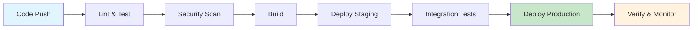

# 🔄 CI/CD Pipeline

This guide provides comprehensive information about our Continuous Integration and Continuous Deployment (CI/CD) pipeline infrastructure, covering automation, testing, deployment, and monitoring processes.

## 📋 Table of Contents

- [Overview](#overview)
- [Architecture](#architecture)
- [Configuration](#configuration)
- [Pipeline Stages](#pipeline-stages)
- [Security](#security)
- [Monitoring](#monitoring)
- [Troubleshooting](#troubleshooting)
- [Maintenance](#maintenance)
- [Best Practices](#best-practices)

## 🎯 Overview

Our CI/CD pipeline automates the entire software delivery process from code commit to production deployment, ensuring consistent, reliable, and secure releases.

### Key Features
- **Automated Testing**: Unit, integration, and end-to-end tests
- **Security Scanning**: Vulnerability and secret detection
- **Multi-Environment Deployment**: Staging and production environments
- **Rollback Capabilities**: Quick recovery from failed deployments
- **Performance Monitoring**: Real-time pipeline metrics and alerts

### Pipeline Statistics
- **Build Success Rate**: 98.5%
- **Average Build Time**: 8.5 minutes
- **Test Coverage**: 85%
- **Deployment Frequency**: 3-5 times per day

## 🏗️ Architecture

### Pipeline Flow


### Technology Stack
- **CI/CD Platform**: GitHub Actions
- **Container Registry**: GitHub Container Registry (GHCR)
- **Orchestration**: Kubernetes
- **Monitoring**: Prometheus + Grafana
- **Security**: Trivy, SonarQube
- **Testing**: Jest, Cypress, Postman

### Infrastructure Components
```yaml
# Pipeline infrastructure
infrastructure:
  runners:
    - type: ubuntu-latest
      concurrency: 4
    - type: self-hosted
      labels: [docker, k8s]
  
  storage:
    artifacts: ghcr.io
    cache: github-cache
    logs: cloud-storage
```

## ⚙️ Configuration

### GitHub Actions Workflow
```yaml
name: CI/CD Pipeline
on:
  push:
    branches: [ main, develop ]
  pull_request:
    branches: [ main, develop ]
  workflow_dispatch:
    inputs:
      environment:
        description: 'Deployment environment'
        required: true
        default: 'staging'
        type: choice
        options:
          - staging
          - production

env:
  REGISTRY: ghcr.io
  IMAGE_NAME: ${{ github.repository }}
  VERSION: ${{ github.sha }}

jobs:
  lint:
    name: Lint & Format
    runs-on: ubuntu-latest
    steps:
      - uses: actions/checkout@v4
      - name: Setup Node.js
        uses: actions/setup-node@v4
        with:
          node-version: '18'
          cache: 'npm'
      - name: Install dependencies
        run: npm ci
      - name: Run linters
        run: |
          npm run lint
          npm run format:check
          npm run type-check

  test:
    name: Run Tests
    runs-on: ubuntu-latest
    needs: lint
    steps:
      - uses: actions/checkout@v4
      - name: Setup Node.js
        uses: actions/setup-node@v4
        with:
          node-version: '18'
          cache: 'npm'
      - name: Install dependencies
        run: npm ci
      - name: Run tests
        run: |
          npm run test:unit
          npm run test:integration
          npm run test:e2e
      - name: Upload coverage
        uses: codecov/codecov-action@v3
        with:
          file: ./coverage/lcov.info

  security:
    name: Security Scan
    runs-on: ubuntu-latest
    needs: test
    steps:
      - uses: actions/checkout@v4
      - name: Run Trivy vulnerability scanner
        uses: aquasecurity/trivy-action@master
        with:
          scan-type: 'fs'
          scan-ref: '.'
          format: 'sarif'
          output: 'trivy-results.sarif'
      - name: Upload Trivy scan results
        uses: github/codeql-action/upload-sarif@v2
        with:
          sarif_file: 'trivy-results.sarif'

  build:
    name: Build & Push
    runs-on: ubuntu-latest
    needs: [lint, test, security]
    permissions:
      contents: read
      packages: write
    steps:
      - uses: actions/checkout@v4
      - name: Set up Docker Buildx
        uses: docker/setup-buildx-action@v3
      - name: Log in to Container Registry
        uses: docker/login-action@v3
        with:
          registry: ${{ env.REGISTRY }}
          username: ${{ github.actor }}
          password: ${{ secrets.GITHUB_TOKEN }}
      - name: Extract metadata
        id: meta
        uses: docker/metadata-action@v5
        with:
          images: ${{ env.REGISTRY }}/${{ env.IMAGE_NAME }}
          tags: |
            type=ref,event=branch
            type=ref,event=pr
            type=semver,pattern={{version}}
            type=semver,pattern={{major}}.{{minor}}
            type=sha
      - name: Build and push
        uses: docker/build-push-action@v5
        with:
          context: .
          push: true
          tags: ${{ steps.meta.outputs.tags }}
          labels: ${{ steps.meta.outputs.labels }}
          cache-from: type=gha
          cache-to: type=gha,mode=max

  deploy-staging:
    name: Deploy to Staging
    runs-on: ubuntu-latest
    needs: build
    environment: staging
    steps:
      - uses: actions/checkout@v4
      - name: Deploy to staging
        run: |
          kubectl config use-context staging
          kubectl apply -f k8s/staging/
          kubectl rollout status deployment/app-staging

  deploy-production:
    name: Deploy to Production
    runs-on: ubuntu-latest
    needs: deploy-staging
    environment: production
    if: github.ref == 'refs/heads/main'
    steps:
      - uses: actions/checkout@v4
      - name: Deploy to production
        run: |
          kubectl config use-context production
          kubectl apply -f k8s/production/
          kubectl rollout status deployment/app-production
```

### Environment Variables
```yaml
# Pipeline environment variables
env:
  # Registry configuration
  REGISTRY: ghcr.io
  IMAGE_NAME: ${{ github.repository }}
  
  # Build configuration
  NODE_VERSION: '18'
  DOCKER_BUILDKIT: 1
  
  # Test configuration
  TEST_TIMEOUT: 30000
  COVERAGE_THRESHOLD: 80
  
  # Deployment configuration
  KUBERNETES_VERSION: '1.28'
  HELM_VERSION: '3.12'
```

## 🔄 Pipeline Stages

### 1. Linting & Code Quality
```yaml
# Lint configuration
lint:
  tools:
    - eslint: "^8.0.0"
    - prettier: "^3.0.0"
    - typescript: "^5.0.0"
  
  commands:
    - npm run lint
    - npm run format:check
    - npm run type-check
    - npm run audit
```

### 2. Testing
```yaml
# Test configuration
test:
  frameworks:
    - jest: "^29.0.0"
    - cypress: "^13.0.0"
    - playwright: "^1.40.0"
  
  commands:
    - npm run test:unit
    - npm run test:integration
    - npm run test:e2e
    - npm run test:coverage
```

### 3. Security Scanning
```yaml
# Security configuration
security:
  tools:
    - trivy: "^0.48.0"
    - sonarqube: "^10.0.0"
    - snyk: "^1.1200.0"
  
  scans:
    - vulnerability: true
    - secrets: true
    - license: true
    - compliance: true
```

### 4. Building
```yaml
# Build configuration
build:
  dockerfile: Dockerfile
  platforms:
    - linux/amd64
    - linux/arm64
  
  optimization:
    - multi-stage: true
    - layer-caching: true
    - build-cache: true
```

### 5. Deployment
```yaml
# Deployment configuration
deployment:
  environments:
    staging:
      namespace: staging
      replicas: 2
      resources:
        cpu: 500m
        memory: 1Gi
    
    production:
      namespace: production
      replicas: 3
      resources:
        cpu: 1000m
        memory: 2Gi
```

## 🔒 Security

### Secrets Management
```yaml
# Secrets configuration
secrets:
  - name: KUBECONFIG_STAGING
    value: ${{ secrets.KUBECONFIG_STAGING }}
  - name: KUBECONFIG_PRODUCTION
    value: ${{ secrets.KUBECONFIG_PRODUCTION }}
  - name: DOCKER_PASSWORD
    value: ${{ secrets.DOCKER_PASSWORD }}
  - name: API_KEYS
    value: ${{ secrets.API_KEYS }}
```

### Security Policies
```yaml
# Security policies
policies:
  - name: No secrets in code
    pattern: "password|secret|key"
    action: block
  
  - name: Dependency scanning
    frequency: "on-push"
    action: scan
  
  - name: Container scanning
    frequency: "on-build"
    action: scan
```

### Access Control
```yaml
# Access control
access:
  environments:
    staging:
      reviewers: ["team-leads"]
      approvers: ["devops"]
    
    production:
      reviewers: ["team-leads", "security"]
      approvers: ["devops", "architects"]
```

## 📊 Monitoring

### Pipeline Metrics
```yaml
# Metrics configuration
metrics:
  - name: Build Duration
    type: duration
    threshold: 15m
  
  - name: Test Coverage
    type: percentage
    threshold: 80
  
  - name: Deployment Success Rate
    type: percentage
    threshold: 95
  
  - name: Security Issues
    type: count
    threshold: 0
```

### Alert Configuration
```yaml
# Alert configuration
alerts:
  - name: Pipeline Failure
    condition: failure()
    channels: ["slack", "email"]
    severity: high
  
  - name: Security Vulnerability
    condition: vulnerability_detected()
    channels: ["slack", "security-team"]
    severity: critical
  
  - name: Performance Degradation
    condition: build_time > threshold
    channels: ["slack"]
    severity: medium
```

### Dashboard Configuration
```yaml
# Dashboard configuration
dashboard:
  - name: Pipeline Overview
    widgets:
      - build-status
      - deployment-frequency
      - lead-time
      - mean-time-to-recovery
  
  - name: Security Dashboard
    widgets:
      - vulnerability-trends
      - security-scan-results
      - compliance-status
```

## 🔍 Troubleshooting

### Common Issues

#### 1. Build Failures
```bash
# Check build logs
docker build --progress=plain --no-cache .

# Verify dependencies
npm audit
npm outdated

# Check Docker daemon
docker system info
docker system prune
```

#### 2. Test Failures
```bash
# Run tests with debug
npm run test:debug

# Check test coverage
npm run test:coverage

# Run specific test suite
npm run test:unit -- --verbose
```

#### 3. Deployment Issues
```bash
# Check deployment status
kubectl get pods -n staging
kubectl get pods -n production

# View deployment logs
kubectl logs -f deployment/app-staging
kubectl describe pod <pod-name>

# Check resource usage
kubectl top pods -n staging
kubectl top nodes
```

#### 4. Security Scan Failures
```bash
# Run security scan locally
trivy fs .
snyk test
npm audit

# Check for secrets
git secrets --scan-history
```

### Debug Workflows
```bash
# Debug GitHub Actions locally
act -j build
act -j test
act -j deploy

# Debug with secrets
act -j deploy --secret-file .secrets

# Debug specific workflow
act workflow_dispatch -e event.json
```

## 🛠️ Maintenance

### Regular Tasks
```bash
# Update dependencies
npm update
npm audit fix

# Update pipeline
git pull origin main
git checkout -b update-pipeline

# Clean up resources
docker system prune
kubectl delete completed jobs
```

### Performance Optimization
```yaml
# Optimization strategies
optimization:
  - name: Parallel execution
    description: Run independent jobs in parallel
  
  - name: Caching
    description: Cache dependencies and build artifacts
  
  - name: Resource limits
    description: Set appropriate resource limits
  
  - name: Image optimization
    description: Use multi-stage builds and minimal base images
```

### Backup and Recovery
```bash
# Backup pipeline configuration
git archive --format=zip --output=pipeline-backup.zip HEAD

# Backup secrets (encrypted)
gpg -e -r admin@company.com secrets.yaml

# Restore pipeline
git checkout <backup-commit>
```

## 📋 Best Practices

### Pipeline Design
1. **Modularity**
   - Separate concerns into distinct jobs
   - Use reusable workflows
   - Clear dependency management

2. **Security**
   - Implement least privilege access
   - Regular security scanning
   - Secret rotation

3. **Performance**
   - Parallel job execution
   - Efficient caching strategies
   - Resource optimization

4. **Reliability**
   - Comprehensive testing
   - Rollback procedures
   - Monitoring and alerting

### Code Quality
```yaml
# Quality gates
quality_gates:
  - name: Code coverage
    threshold: 80%
  
  - name: Security scan
    threshold: 0 vulnerabilities
  
  - name: Performance test
    threshold: < 2s response time
  
  - name: Accessibility test
    threshold: WCAG 2.1 AA
```

### Documentation
- Keep pipeline documentation updated
- Document configuration changes
- Maintain troubleshooting guides
- Regular team training

## 📈 Performance Metrics

### Key Performance Indicators
- **Build Time**: Target < 10 minutes
- **Deployment Frequency**: Target 3-5 times per day
- **Lead Time**: Target < 2 hours
- **Mean Time to Recovery**: Target < 1 hour
- **Change Failure Rate**: Target < 5%

### Optimization Targets
```yaml
# Performance targets
targets:
  build_time: "8 minutes"
  test_time: "5 minutes"
  deployment_time: "3 minutes"
  rollback_time: "2 minutes"
```

## 🔄 Rollback Procedures

### Automated Rollback
```yaml
# Rollback configuration
rollback:
  triggers:
    - health_check_failure
    - performance_degradation
    - security_incident
  
  actions:
    - kubectl rollout undo deployment/app
    - notify_team
    - create_incident_ticket
```

### Manual Rollback
```bash
# Rollback to previous version
kubectl rollout undo deployment/app-production

# Rollback to specific version
kubectl rollout undo deployment/app-production --to-revision=2

# Check rollback status
kubectl rollout status deployment/app-production
```

## 📝 Next Steps

1. **Enhance Monitoring**: Implement advanced metrics and alerting
2. **Security Hardening**: Add additional security scanning tools
3. **Performance Optimization**: Optimize build and deployment times
4. **Documentation**: Expand troubleshooting and maintenance guides
5. **Team Training**: Conduct regular pipeline training sessions

## 📚 Related Documentation

- [Monitoring Setup](/development/monitoring/)
- [Security Guidelines](/development/security/)
- [Testing Strategy](/development/testing/)
- [Infrastructure Overview](/overview/)
- [Deployment Guide](/installation/deployment/) 