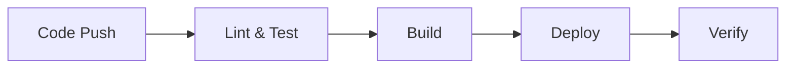

# 🔄 CI/CD Pipeline

This guide provides comprehensive information about our Continuous Integration and Continuous Deployment (CI/CD) pipeline.

## 📋 Pipeline Overview

### Pipeline Stages


### Workflow Triggers
```yaml
# GitHub Actions triggers
on:
  push:
    branches: [ main, develop ]
  pull_request:
    branches: [ main, develop ]
  workflow_dispatch:
```

## 🛠️ Pipeline Configuration

### GitHub Actions Workflow
```yaml
name: CI/CD Pipeline
on:
  push:
    branches: [ main ]
jobs:
  lint:
    runs-on: ubuntu-latest
    steps:
      - uses: actions/checkout@v2
      - name: Lint
        run: make lint

  test:
    runs-on: ubuntu-latest
    steps:
      - uses: actions/checkout@v2
      - name: Test
        run: make test

  build:
    runs-on: ubuntu-latest
    steps:
      - uses: actions/checkout@v2
      - name: Build
        run: make build

  deploy:
    runs-on: ubuntu-latest
    steps:
      - uses: actions/checkout@v2
      - name: Deploy
        run: make deploy
```

### Environment Variables
```yaml
# Pipeline environment variables
env:
  REGISTRY: ghcr.io
  IMAGE_NAME: ${{ github.repository }}
```

## 📊 Pipeline Stages

### Linting
```yaml
# Lint configuration
lint:
  steps:
    - name: Run linters
      run: |
        make lint-python
        make lint-yaml
        make lint-markdown
```

### Testing
```yaml
# Test configuration
test:
  steps:
    - name: Run tests
      run: |
        make test-unit
        make test-integration
        make test-e2e
```

### Building
```yaml
# Build configuration
build:
  steps:
    - name: Build container
      run: |
        docker build -t ${{ env.REGISTRY }}/${{ env.IMAGE_NAME }}:${{ github.sha }} .
```

### Deployment
```yaml
# Deploy configuration
deploy:
  steps:
    - name: Deploy to Kubernetes
      run: |
        kubectl apply -f k8s/
```

### Verification
```yaml
# Verify configuration
verify:
  steps:
    - name: Verify deployment
      run: |
        make verify-health
        make verify-metrics
```

## 🔒 Security Measures

### Secrets Management
```yaml
# Secrets configuration
secrets:
  - name: KUBECONFIG
    value: ${{ secrets.KUBECONFIG }}
  - name: DOCKER_PASSWORD
    value: ${{ secrets.DOCKER_PASSWORD }}
```

### Security Scanning
```yaml
# Security scan configuration
security:
  steps:
    - name: Run security scan
      run: |
        make scan-vulnerabilities
        make scan-secrets
```

## 📈 Monitoring and Alerts

### Pipeline Monitoring
```yaml
# Monitoring configuration
monitoring:
  steps:
    - name: Monitor pipeline
      run: |
        make monitor-pipeline
        make monitor-resources
```

### Alert Configuration
```yaml
# Alert configuration
alerts:
  - name: Pipeline Failure
    condition: failure()
    action: notify-slack
  - name: Deployment Failure
    condition: deployment-failed()
    action: notify-slack
```

## 🔍 Troubleshooting

### Common Issues
1. **Build Failures**
   ```bash
   # Check build logs
   docker build --progress=plain .
   
   # Verify dependencies
   make check-deps
   ```

2. **Test Failures**
   ```bash
   # Run tests with debug
   make test-debug
   
   # Check test coverage
   make coverage
   ```

3. **Deployment Issues**
   ```bash
   # Check deployment status
   kubectl get pods
   
   # View deployment logs
   kubectl logs -f deployment/myapp
   ```

## 📝 Best Practices

### Pipeline Design
1. **Modularity**
   - Separate concerns
   - Reusable components
   - Clear dependencies

2. **Security**
   - Secret management
   - Access control
   - Vulnerability scanning

3. **Performance**
   - Parallel execution
   - Caching
   - Resource optimization

### Pipeline Maintenance
1. **Regular Updates**
   ```bash
   # Update dependencies
   make update-deps
   
   # Update pipeline
   make update-pipeline
   ```

2. **Documentation**
   - Pipeline changes
   - Configuration updates
   - Troubleshooting guides

## 🧪 Local Testing

### Pipeline Testing
```bash
# Run pipeline locally
make pipeline-local

# Test specific stage
make test-stage=build
```

### Debug Workflows
```bash
# Debug workflow
act -j build

# Debug with secrets
act -j deploy --secret-file .secrets
```

## 📈 Performance Optimization

### Build Optimization
```dockerfile
# Optimized Dockerfile
FROM node:16-alpine AS builder
WORKDIR /app
COPY package*.json ./
RUN npm ci
COPY . .
RUN npm run build

FROM node:16-alpine
WORKDIR /app
COPY --from=builder /app/dist ./dist
COPY --from=builder /app/node_modules ./node_modules
CMD ["npm", "start"]
```

### Cache Management
```yaml
# Cache configuration
cache:
  - name: node_modules
    path: node_modules
  - name: docker
    path: ~/.docker
```

## 🔄 Rollback Procedures

### Deployment Rollback
```bash
# Rollback deployment
kubectl rollout undo deployment/myapp

# Check rollback status
kubectl rollout status deployment/myapp
```

### Data Rollback
```bash
# Backup before rollback
make backup-data

# Restore from backup
make restore-data
```

## 📊 Reporting

### Pipeline Reports
```yaml
# Report configuration
reports:
  - name: Test Report
    type: junit
    path: test-results.xml
  - name: Coverage Report
    type: cobertura
    path: coverage.xml
```

### Metrics Collection
```yaml
# Metrics configuration
metrics:
  - name: Build Time
    type: duration
  - name: Test Coverage
    type: percentage
```

## 📝 Next Steps

1. Configure [Monitoring](/development/monitoring/)
2. Set up [Testing Infrastructure](/development/testing/)
3. Review [Security Measures](/development/security/)
4. Contribute to [Documentation](/development/documentation/) 