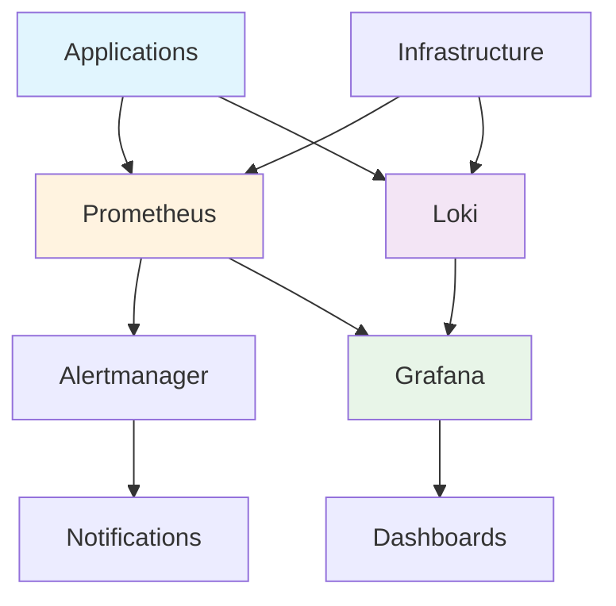
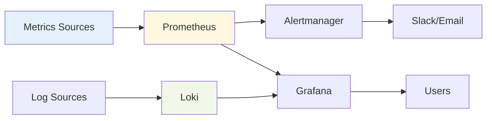

# 📊 Monitoring Infrastructure

This guide provides comprehensive information about our monitoring infrastructure, covering metrics collection, log aggregation, alerting systems, and visualization dashboards.

## 📋 Table of Contents

- [Overview](#overview)
- [Architecture](#architecture)
- [Components](#components)
- [Configuration](#configuration)
- [Dashboards](#dashboards)
- [Alerting](#alerting)
- [Security](#security)
- [Troubleshooting](#troubleshooting)
- [Maintenance](#maintenance)
- [Best Practices](#best-practices)

## 🎯 Overview

Our monitoring infrastructure provides comprehensive visibility into system health, performance metrics, and operational insights across the entire homelab environment.

### Key Features
- **Real-time Metrics**: System, application, and infrastructure monitoring
- **Centralized Logging**: Aggregated log collection and analysis
- **Intelligent Alerting**: Multi-channel notifications with escalation
- **Visual Dashboards**: Customizable Grafana dashboards
- **Performance Analytics**: Historical data analysis and trending

### Monitoring Statistics
- **Metrics Retention**: 30 days for high-resolution, 1 year for aggregated
- **Log Retention**: 90 days with compression
- **Alert Response Time**: < 5 minutes for critical alerts
- **System Uptime**: 99.9% monitoring availability

## 🏗️ Architecture

### Monitoring Stack Overview


### Data Flow Architecture


## 🔧 Components

### Core Monitoring Stack
- **Prometheus**: Time-series database for metrics collection
- **Grafana**: Visualization and dashboard platform
- **Alertmanager**: Alert routing and notification management
- **Loki**: Log aggregation and querying
- **Node Exporter**: System metrics collection
- **cAdvisor**: Container metrics collection

### Infrastructure Components
```yaml
# Monitoring infrastructure
infrastructure:
  prometheus:
    version: "2.45.0"
    retention: "30d"
    storage: "50Gi"
  
  grafana:
    version: "10.0.0"
    dashboards: "100+"
    users: "10+"
  
  loki:
    version: "2.9.0"
    retention: "90d"
    storage: "100Gi"
  
  alertmanager:
    version: "0.25.0"
    channels: ["slack", "email", "discord"]
```

## ⚙️ Configuration

### Prometheus Configuration
```yaml
# prometheus.yml
global:
  scrape_interval: 15s
  evaluation_interval: 15s

rule_files:
  - "alert_rules.yml"

scrape_configs:
  - job_name: 'kubernetes-pods'
    kubernetes_sd_configs:
      - role: pod
    relabel_configs:
      - source_labels: [__meta_kubernetes_pod_annotation_prometheus_io_scrape]
        action: keep
        regex: true
      - source_labels: [__meta_kubernetes_pod_annotation_prometheus_io_path]
        action: replace
        target_label: __metrics_path__
        regex: (.+)
      - source_labels: [__address__, __meta_kubernetes_pod_annotation_prometheus_io_port]
        action: replace
        regex: ([^:]+)(?::\d+)?;(\d+)
        replacement: $1:$2
        target_label: __address__

  - job_name: 'node-exporter'
    static_configs:
      - targets: ['node-exporter:9100']

  - job_name: 'cadvisor'
    static_configs:
      - targets: ['cadvisor:8080']
```

### Grafana Configuration
```yaml
# grafana.ini
[server]
http_port = 3000
domain = grafana.yourdomain.com

[database]
type = postgres
host = postgres:5432
name = grafana
user = grafana
password = ${GRAFANA_PASSWORD}

[security]
admin_user = admin
admin_password = ${ADMIN_PASSWORD}

[users]
allow_sign_up = false

[alerting]
enabled = true
execute_alerts = true

[unified_alerting]
enabled = true
```

### Loki Configuration
```yaml
# loki-config.yaml
auth_enabled: false

server:
  http_listen_port: 3100

ingester:
  lifecycler:
    address: 127.0.0.1
    ring:
      kvstore:
        store: inmemory
      replication_factor: 1
    final_sleep: 0s
  chunk_idle_period: 5m
  chunk_retain_period: 30s

schema_config:
  configs:
    - from: 2020-05-15
      store: boltdb-shipper
      object_store: filesystem
      schema: v11
      index:
        prefix: index_
        period: 24h

storage_config:
  boltdb_shipper:
    active_index_directory: /tmp/loki/boltdb-shipper-active
    cache_location: /tmp/loki/boltdb-shipper-cache
    cache_ttl: 24h
    shared_store: filesystem
  filesystem:
    directory: /tmp/loki/chunks

compactor:
  working_directory: /tmp/loki/boltdb-shipper-compactor
  shared_store: filesystem

limits_config:
  reject_old_samples: true
  reject_old_samples_max_age: 168h
```

### Alertmanager Configuration
```yaml
# alertmanager.yml
global:
  resolve_timeout: 5m
  slack_api_url: 'https://hooks.slack.com/services/YOUR/SLACK/WEBHOOK'

route:
  group_by: ['alertname']
  group_wait: 10s
  group_interval: 10s
  repeat_interval: 1h
  receiver: 'slack-notifications'
  routes:
    - match:
        severity: critical
      receiver: 'critical-alerts'
      repeat_interval: 30m

receivers:
  - name: 'slack-notifications'
    slack_configs:
      - channel: '#monitoring'
        title: '{{ template "slack.title" . }}'
        text: '{{ template "slack.text" . }}'
        send_resolved: true

  - name: 'critical-alerts'
    slack_configs:
      - channel: '#alerts-critical'
        title: '🚨 CRITICAL: {{ template "slack.title" . }}'
        text: '{{ template "slack.text" . }}'
        send_resolved: true
    email_configs:
      - to: 'admin@yourdomain.com'
        send_resolved: true

templates:
  - '/etc/alertmanager/template/*.tmpl'
```

## 📊 Dashboards

### System Overview Dashboard
```json
{
  "dashboard": {
    "title": "System Overview",
    "panels": [
      {
        "title": "CPU Usage",
        "type": "graph",
        "targets": [
          {
            "expr": "100 - (avg by (instance) (irate(node_cpu_seconds_total{mode=\"idle\"}[5m])) * 100)"
          }
        ]
      },
      {
        "title": "Memory Usage",
        "type": "graph",
        "targets": [
          {
            "expr": "(node_memory_MemTotal_bytes - node_memory_MemAvailable_bytes) / node_memory_MemTotal_bytes * 100"
          }
        ]
      },
      {
        "title": "Disk Usage",
        "type": "graph",
        "targets": [
          {
            "expr": "(node_filesystem_size_bytes - node_filesystem_free_bytes) / node_filesystem_size_bytes * 100"
          }
        ]
      }
    ]
  }
}
```

### Application Metrics Dashboard
```yaml
# Application dashboard configuration
application_dashboard:
  panels:
    - name: "Request Rate"
      query: "rate(http_requests_total[5m])"
      visualization: "line"
    
    - name: "Error Rate"
      query: "rate(http_requests_total{status=~\"5..\"}[5m])"
      visualization: "line"
    
    - name: "Response Time"
      query: "histogram_quantile(0.95, rate(http_request_duration_seconds_bucket[5m]))"
      visualization: "line"
    
    - name: "Active Connections"
      query: "http_connections_active"
      visualization: "stat"
```

### Kubernetes Dashboard
```yaml
# Kubernetes dashboard configuration
kubernetes_dashboard:
  panels:
    - name: "Pod Status"
      query: "kube_pod_status_phase"
      visualization: "pie"
    
    - name: "Node Resources"
      query: "kube_node_status_condition"
      visualization: "table"
    
    - name: "Service Health"
      query: "kube_service_status_condition"
      visualization: "stat"
```

## 🚨 Alerting

### Alert Rules Configuration
```yaml
# alert_rules.yml
groups:
  - name: system_alerts
    rules:
      - alert: HighCPUUsage
        expr: 100 - (avg by(instance) (irate(node_cpu_seconds_total{mode="idle"}[5m])) * 100) > 80
        for: 5m
        labels:
          severity: warning
        annotations:
          summary: "High CPU usage on {{ $labels.instance }}"
          description: "CPU usage is above 80% for more than 5 minutes"

      - alert: HighMemoryUsage
        expr: (node_memory_MemTotal_bytes - node_memory_MemAvailable_bytes) / node_memory_MemTotal_bytes * 100 > 85
        for: 5m
        labels:
          severity: warning
        annotations:
          summary: "High memory usage on {{ $labels.instance }}"
          description: "Memory usage is above 85% for more than 5 minutes"

      - alert: DiskSpaceLow
        expr: (node_filesystem_size_bytes - node_filesystem_free_bytes) / node_filesystem_size_bytes * 100 > 90
        for: 5m
        labels:
          severity: critical
        annotations:
          summary: "Low disk space on {{ $labels.instance }}"
          description: "Disk usage is above 90% for more than 5 minutes"

  - name: application_alerts
    rules:
      - alert: ServiceDown
        expr: up == 0
        for: 1m
        labels:
          severity: critical
        annotations:
          summary: "Service {{ $labels.job }} is down"
          description: "Service {{ $labels.job }} has been down for more than 1 minute"

      - alert: HighErrorRate
        expr: rate(http_requests_total{status=~"5.."}[5m]) / rate(http_requests_total[5m]) * 100 > 5
        for: 5m
        labels:
          severity: warning
        annotations:
          summary: "High error rate for {{ $labels.job }}"
          description: "Error rate is above 5% for more than 5 minutes"
```

### Notification Channels
```yaml
# Notification configuration
notifications:
  slack:
    webhook_url: "https://hooks.slack.com/services/YOUR/SLACK/WEBHOOK"
    channel: "#monitoring"
    username: "Monitoring Bot"
  
  email:
    smtp_host: "smtp.gmail.com"
    smtp_port: 587
    from: "monitoring@yourdomain.com"
    to: ["admin@yourdomain.com"]
  
  discord:
    webhook_url: "https://discord.com/api/webhooks/YOUR/WEBHOOK"
    channel: "#alerts"
```

## 🔒 Security

### Access Control
```yaml
# Security configuration
security:
  authentication:
    type: "oauth2"
    provider: "github"
    allowed_organizations: ["your-org"]
  
  authorization:
    admin_users: ["admin@yourdomain.com"]
    viewer_users: ["viewer@yourdomain.com"]
  
  network_policies:
    - name: "monitoring-network-policy"
      namespace: "monitoring"
      ingress:
        - from:
            - namespaceSelector:
                matchLabels:
                  name: "monitoring"
```

### Data Protection
```yaml
# Data protection configuration
data_protection:
  encryption:
    at_rest: true
    in_transit: true
  
  retention:
    metrics: "30d"
    logs: "90d"
    alerts: "1y"
  
  backup:
    frequency: "daily"
    retention: "30d"
    encryption: true
```

## 🔍 Troubleshooting

### Common Issues

#### 1. Prometheus Issues
```bash
# Check Prometheus status
kubectl get pods -n monitoring -l app=prometheus

# View Prometheus logs
kubectl logs -f deployment/prometheus-server -n monitoring

# Check Prometheus targets
kubectl port-forward -n monitoring svc/prometheus-server 9090:9090
curl localhost:9090/api/v1/targets

# Check Prometheus configuration
kubectl get configmap prometheus-server-config -n monitoring -o yaml
```

#### 2. Grafana Issues
```bash
# Check Grafana status
kubectl get pods -n monitoring -l app=grafana

# View Grafana logs
kubectl logs -f deployment/grafana -n monitoring

# Check Grafana configuration
kubectl get configmap grafana-config -n monitoring -o yaml

# Reset Grafana admin password
kubectl exec -it deployment/grafana -n monitoring -- grafana-cli admin reset-admin-password newpassword
```

#### 3. Loki Issues
```bash
# Check Loki status
kubectl get pods -n monitoring -l app=loki

# View Loki logs
kubectl logs -f deployment/loki -n monitoring

# Test Loki query
kubectl port-forward -n monitoring svc/loki 3100:3100
curl -G -s "http://localhost:3100/loki/api/v1/query" --data-urlencode 'query={job="loki"}'
```

#### 4. Alertmanager Issues
```bash
# Check Alertmanager status
kubectl get pods -n monitoring -l app=alertmanager

# View Alertmanager logs
kubectl logs -f deployment/alertmanager -n monitoring

# Check Alertmanager configuration
kubectl get configmap alertmanager-config -n monitoring -o yaml

# Test alert notification
kubectl port-forward -n monitoring svc/alertmanager 9093:9093
curl -X POST http://localhost:9093/api/v1/alerts -d '[{"labels":{"alertname":"test"}}]'
```

### Performance Issues
```bash
# Check resource usage
kubectl top pods -n monitoring

# Check storage usage
kubectl exec -it deployment/prometheus-server -n monitoring -- df -h

# Check memory usage
kubectl exec -it deployment/prometheus-server -n monitoring -- free -h

# Check network connectivity
kubectl exec -it deployment/prometheus-server -n monitoring -- ping -c 4 kubernetes.default
```

## 🛠️ Maintenance

### Regular Tasks
```bash
# Update monitoring stack
helm upgrade prometheus prometheus-community/kube-prometheus-stack -n monitoring

# Clean up old metrics
kubectl exec -it deployment/prometheus-server -n monitoring -- promtool tsdb clean

# Backup monitoring data
kubectl exec -it deployment/prometheus-server -n monitoring -- tar -czf /tmp/backup.tar.gz /prometheus

# Update Grafana dashboards
kubectl apply -f dashboards/ -n monitoring

# Rotate logs
kubectl exec -it deployment/loki -n monitoring -- logrotate /etc/logrotate.conf
```

### Performance Optimization
```yaml
# Performance optimization
optimization:
  prometheus:
    - name: "Increase retention"
      value: "60d"
    - name: "Optimize queries"
      value: "use recording rules"
    - name: "Compress data"
      value: "enable compression"
  
  grafana:
    - name: "Cache dashboards"
      value: "enable caching"
    - name: "Optimize queries"
      value: "use query caching"
  
  loki:
    - name: "Compress logs"
      value: "enable compression"
    - name: "Optimize queries"
      value: "use query caching"
```

### Backup and Recovery
```bash
# Backup Prometheus data
kubectl exec -it deployment/prometheus-server -n monitoring -- tar -czf /tmp/prometheus-backup.tar.gz /prometheus

# Backup Grafana configuration
kubectl get configmap grafana-config -n monitoring -o yaml > grafana-config-backup.yaml

# Backup Loki data
kubectl exec -it deployment/loki -n monitoring -- tar -czf /tmp/loki-backup.tar.gz /loki

# Restore from backup
kubectl cp grafana-config-backup.yaml monitoring/grafana-config:config.yaml
kubectl rollout restart deployment/grafana -n monitoring
```

## 📋 Best Practices

### Monitoring Design
1. **Define Clear Objectives**
   - Business metrics
   - Technical metrics
   - User experience metrics

2. **Set Appropriate Thresholds**
   - Warning levels
   - Critical levels
   - Escalation procedures

3. **Implement Proper Retention**
   - Metrics retention
   - Log retention
   - Alert history

### Alert Management
```yaml
# Alert best practices
alert_best_practices:
  - name: "Use meaningful names"
    description: "Clear, descriptive alert names"
  
  - name: "Set appropriate thresholds"
    description: "Realistic warning and critical levels"
  
  - name: "Implement escalation"
    description: "Proper escalation procedures"
  
  - name: "Regular review"
    description: "Monthly alert review and cleanup"
```

### Dashboard Design
```yaml
# Dashboard best practices
dashboard_best_practices:
  - name: "Keep focused"
    description: "One dashboard per service/team"
  
  - name: "Use appropriate visualizations"
    description: "Right chart type for the data"
  
  - name: "Include context"
    description: "Add descriptions and documentation"
  
  - name: "Regular updates"
    description: "Keep dashboards current"
```

## 📈 Performance Metrics

### Key Performance Indicators
- **Data Collection Rate**: Target > 99.9%
- **Query Response Time**: Target < 1s
- **Alert Delivery Time**: Target < 30s
- **Dashboard Load Time**: Target < 3s

### Optimization Targets
```yaml
# Performance targets
targets:
  prometheus_scrape_duration: "15s"
  grafana_query_time: "1s"
  loki_query_time: "2s"
  alert_delivery_time: "30s"
```

## 📝 Next Steps

1. **Enhance Monitoring**: Add custom metrics and dashboards
2. **Security Hardening**: Implement additional security measures
3. **Performance Optimization**: Optimize query performance and storage
4. **Documentation**: Expand troubleshooting and maintenance guides
5. **Team Training**: Conduct monitoring tool training sessions

## 📚 Related Documentation

- [CI/CD Pipeline](/development/ci-cd/)
- [Infrastructure Overview](/overview/)
- [Security Guidelines](/development/security/)
- [Deployment Guide](/installation/deployment/)
- [Troubleshooting Guide](/troubleshooting/) 