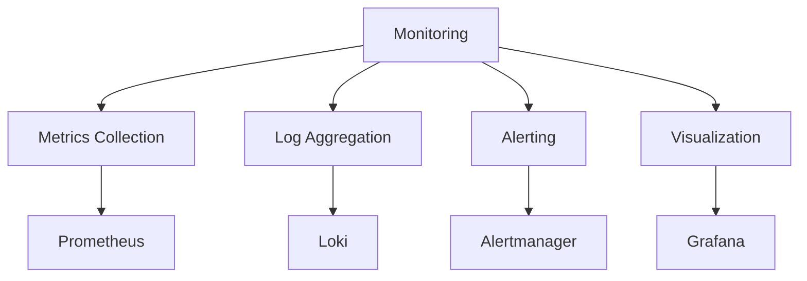

This guide explains the monitoring infrastructure used in the homelab project. We'll cover the monitoring stack, metrics collection, alerting, and visualization.

## Monitoring Overview

### 1. Monitoring Stack


### 2. Monitoring Components
- Metrics Collection: Prometheus
- Log Aggregation: Loki
- Alerting: Alertmanager
- Visualization: Grafana
- Node Exporter: System metrics
- cAdvisor: Container metrics

## Infrastructure Monitoring

### 1. Hardware Monitoring
```yaml
hardware:
  - name: node-exporter
    metrics:
      - cpu_usage
      - memory_usage
      - disk_usage
      - network_io
      - temperature
```

### 2. Network Monitoring
```yaml
network:
  - name: network-exporter
    metrics:
      - bandwidth
      - latency
      - packet_loss
      - connection_count
```

## Application Monitoring

### 1. Container Metrics
```yaml
containers:
  - name: cadvisor
    metrics:
      - container_cpu
      - container_memory
      - container_network
      - container_io
```

### 2. Service Health
```yaml
services:
  - name: service-monitor
    checks:
      - health_check
      - readiness_check
      - liveness_check
```

## Log Management

### 1. Log Collection
```yaml
logging:
  - name: loki
    sources:
      - container_logs
      - system_logs
      - application_logs
    retention: 30d
```

### 2. Log Analysis
```yaml
analysis:
  - name: log-analysis
    features:
      - log_search
      - log_aggregation
      - log_visualization
```

## Alerting System

### 1. Alert Rules
```yaml
alerts:
  - name: system-alerts
    rules:
      - high_cpu_usage
      - low_memory
      - disk_space
      - service_down
```

### 2. Notification Channels
```yaml
notifications:
  - name: alert-channels
    types:
      - email
      - slack
      - discord
      - telegram
```

## Dashboard Configuration

### 1. System Dashboards
```yaml
dashboards:
  - name: system-overview
    panels:
      - cpu_usage
      - memory_usage
      - disk_usage
      - network_io
```

### 2. Application Dashboards
```yaml
app-dashboards:
  - name: application-metrics
    panels:
      - request_rate
      - error_rate
      - response_time
      - resource_usage
```

## Performance Monitoring

### 1. Resource Usage
```yaml
performance:
  - name: resource-monitoring
    metrics:
      - cpu_percent
      - memory_percent
      - disk_io
      - network_io
```

### 2. Service Performance
```yaml
service-performance:
  - name: service-metrics
    indicators:
      - response_time
      - throughput
      - error_rate
      - availability
```

## Security Monitoring

### 1. Security Metrics
```yaml
security:
  - name: security-monitoring
    checks:
      - failed_logins
      - unauthorized_access
      - certificate_expiry
      - vulnerability_scan
```

### 2. Compliance Monitoring
```yaml
compliance:
  - name: compliance-checks
    rules:
      - security_policy
      - access_control
      - audit_logs
```

## Best Practices

### 1. Monitoring Setup
- Define clear monitoring objectives
- Set appropriate alert thresholds
- Implement proper retention policies
- Regular backup of monitoring data

### 2. Alert Management
- Use meaningful alert names
- Implement proper escalation
- Regular alert review
- Document alert procedures

### 3. Dashboard Design
- Keep dashboards focused
- Use appropriate visualizations
- Regular dashboard review
- Document dashboard purpose

## Troubleshooting

### Common Monitoring Issues

1. **Data Collection**
   ```bash
   # Check Prometheus targets
   kubectl port-forward -n monitoring svc/prometheus-server 9090:9090
   
   # Verify metrics collection
   curl localhost:9090/api/v1/targets
   ```

2. **Alert Issues**
   ```bash
   # Check Alertmanager
   kubectl port-forward -n monitoring svc/alertmanager 9093:9093
   
   # Verify alert rules
   kubectl get prometheusrule -n monitoring
   ```

3. **Log Collection**
   ```bash
   # Check Loki
   kubectl port-forward -n monitoring svc/loki 3100:3100
   
   # Verify log collection
   curl -G -s "http://localhost:3100/loki/api/v1/query" --data-urlencode 'query={job="loki"}'
   ```

## Next Steps

After setting up monitoring:

1. Configure [CI/CD pipeline](/development/ci-cd/)
2. Set up [testing infrastructure](/development/testing/)
3. Review [security measures](/development/security/)
4. Start [contributing](/contributing/) 