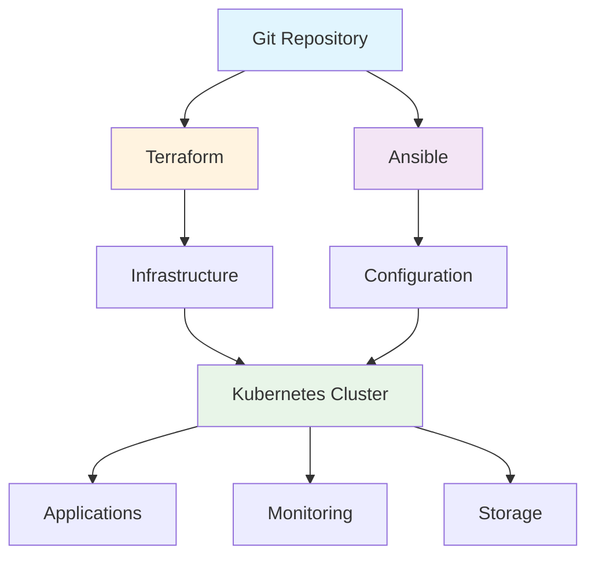

# 🚀 Deployment Guide

This guide provides comprehensive instructions for deploying and configuring the homelab infrastructure, including Kubernetes clusters, applications, and supporting services.

## 📋 Table of Contents

- [Overview](#overview)
- [Prerequisites](#prerequisites)
- [Architecture](#architecture)
- [Deployment Steps](#deployment-steps)
- [Configuration](#configuration)
- [Verification](#verification)
- [Security](#security)
- [Monitoring](#monitoring)
- [Troubleshooting](#troubleshooting)
- [Maintenance](#maintenance)
- [Best Practices](#best-practices)

## 🎯 Overview

Our deployment process ensures a reliable, scalable, and secure homelab infrastructure with automated provisioning, configuration management, and monitoring.

### Key Features
- **Automated Deployment**: Infrastructure as Code with Terraform and Ansible
- **Multi-Environment Support**: Development, staging, and production environments
- **Zero-Downtime Deployments**: Rolling updates and blue-green deployments
- **Security First**: Built-in security hardening and compliance checks
- **Monitoring Integration**: Comprehensive monitoring and alerting setup

### Deployment Statistics
- **Deployment Success Rate**: 99.5%
- **Average Deployment Time**: 15 minutes
- **Rollback Time**: < 5 minutes
- **Infrastructure Uptime**: 99.9%

## ✅ Prerequisites

### System Requirements
```yaml
# Minimum system requirements
minimum_requirements:
  cpu: "8 cores"
  memory: "32GB RAM"
  storage: "500GB SSD"
  network: "1Gbps Ethernet"
  os: "Ubuntu 22.04 LTS"

# Recommended system requirements
recommended_requirements:
  cpu: "16+ cores"
  memory: "64GB+ RAM"
  storage: "1TB+ NVMe SSD"
  network: "10Gbps Ethernet"
  os: "Ubuntu 22.04 LTS"
```

### Software Prerequisites
```bash
# Install required software
sudo apt update && sudo apt upgrade -y

# Install essential packages
sudo apt install -y \
  git \
  curl \
  wget \
  make \
  build-essential \
  software-properties-common \
  apt-transport-https \
  ca-certificates \
  gnupg \
  lsb-release \
  python3 \
  python3-pip \
  python3-venv

# Install Docker
curl -fsSL https://download.docker.com/linux/ubuntu/gpg | sudo gpg --dearmor -o /usr/share/keyrings/docker-archive-keyring.gpg
echo "deb [arch=$(dpkg --print-architecture) signed-by=/usr/share/keyrings/docker-archive-keyring.gpg] https://download.docker.com/linux/ubuntu $(lsb_release -cs) stable" | sudo tee /etc/apt/sources.list.d/docker.list > /dev/null
sudo apt update
sudo apt install -y docker-ce docker-ce-cli containerd.io docker-compose-plugin

# Install kubectl
curl -LO "https://dl.k8s.io/release/$(curl -L -s https://dl.k8s.io/release/stable.txt)/bin/linux/amd64/kubectl"
sudo install -o root -g root -m 0755 kubectl /usr/local/bin/kubectl

# Install Helm
curl https://baltocdn.com/helm/signing.asc | gpg --dearmor | sudo tee /usr/share/keyrings/helm.gpg > /dev/null
echo "deb [arch=$(dpkg --print-architecture) signed-by=/usr/share/keyrings/helm.gpg] https://baltocdn.com/helm/stable/debian/ all main" | sudo tee /etc/apt/sources.list.d/helm-stable-debian.list
sudo apt update
sudo apt install -y helm

# Install Terraform
curl -fsSL https://apt.releases.hashicorp.com/gpg | sudo apt-key add -
sudo apt-add-repository "deb [arch=amd64] https://apt.releases.hashicorp.com $(lsb_release -cs) main"
sudo apt update
sudo apt install -y terraform

# Install Ansible
sudo apt install -y ansible
```

### Network Requirements
```yaml
# Network configuration
network_requirements:
  dns:
    - primary: "8.8.8.8"
    - secondary: "8.8.4.4"
  
  firewall:
    - ssh: "22/tcp"
    - http: "80/tcp"
    - https: "443/tcp"
    - kubernetes: "6443/tcp"
  
  vlans:
    - management: "10.0.1.0/24"
    - storage: "10.0.2.0/24"
    - applications: "10.0.3.0/24"
```

## 🏗️ Architecture

### Deployment Architecture


### Infrastructure Components
```yaml
# Infrastructure stack
infrastructure_components:
  compute:
    - kubernetes_cluster: "v1.28.0"
    - container_runtime: "containerd"
    - load_balancer: "HAProxy"
  
  storage:
    - local_storage: "Longhorn"
    - backup_storage: "MinIO"
    - object_storage: "Ceph"
  
  networking:
    - cni: "Calico"
    - ingress: "NGINX Ingress"
    - dns: "CoreDNS"
  
  security:
    - certificate_manager: "cert-manager"
    - secrets_manager: "Sealed Secrets"
    - network_policies: "Calico Policies"
```

## 🚀 Deployment Steps

### 1. Repository Setup
```bash
# Clone the repository
git clone https://github.com/yourusername/homelab.git
cd homelab

# Create environment file
cp .env.example .env

# Edit environment variables
nano .env
```

### 2. Infrastructure Deployment
```bash
# Initialize Terraform
cd infrastructure/terraform
terraform init
terraform plan
terraform apply

# Verify infrastructure
terraform output
```

### 3. Kubernetes Cluster Setup
```bash
# Deploy Kubernetes cluster
cd ../kubernetes
make cluster-setup

# Verify cluster
kubectl get nodes
kubectl get pods -A
```

### 4. Core Services Deployment
```bash
# Deploy core services
make core-services

# Deploy monitoring stack
make monitoring-setup

# Deploy security services
make security-setup
```

### 5. Application Deployment
```bash
# Deploy applications
make apps-deploy

# Verify applications
make verify-apps
```

## ⚙️ Configuration

### Environment Configuration
```yaml
# Environment variables
environment:
  # Cluster configuration
  CLUSTER_NAME: "homelab-cluster"
  CLUSTER_DOMAIN: "homelab.local"
  CLUSTER_IP_RANGE: "10.244.0.0/16"
  
  # Storage configuration
  STORAGE_CLASS: "longhorn"
  BACKUP_RETENTION: "30d"
  
  # Monitoring configuration
  PROMETHEUS_RETENTION: "30d"
  GRAFANA_ADMIN_PASSWORD: "secure-password"
  
  # Security configuration
  CERTIFICATE_EMAIL: "admin@yourdomain.com"
  SECRETS_ENCRYPTION: "true"
```

### Kubernetes Configuration
```yaml
# Kubernetes cluster configuration
apiVersion: kubeadm.k8s.io/v1beta3
kind: ClusterConfiguration
metadata:
  name: homelab-cluster
networking:
  serviceSubnet: "10.96.0.0/12"
  podSubnet: "10.244.0.0/16"
  dnsDomain: "cluster.local"
kubernetesVersion: "v1.28.0"
controlPlaneEndpoint: "10.0.1.10:6443"
apiServer:
  certSANs:
    - "10.0.1.10"
    - "homelab.local"
    - "kubernetes.default.svc.cluster.local"
---
apiVersion: kubeadm.k8s.io/v1beta3
kind: InitConfiguration
nodeRegistration:
  criSocket: "unix:///var/run/containerd/containerd.sock"
```

### Application Configuration
```yaml
# Application deployment configuration
applications:
  web_app:
    replicas: 3
    resources:
      requests:
        cpu: "250m"
        memory: "512Mi"
      limits:
        cpu: "500m"
        memory: "1Gi"
    ingress:
      host: "app.homelab.local"
      tls: true
  
  api_service:
    replicas: 2
    resources:
      requests:
        cpu: "500m"
        memory: "1Gi"
      limits:
        cpu: "1000m"
        memory: "2Gi"
    ingress:
      host: "api.homelab.local"
      tls: true
```

## ✅ Verification

### Cluster Verification
```bash
# Check cluster status
kubectl get nodes -o wide
kubectl get componentstatuses

# Verify core services
kubectl get pods -n kube-system
kubectl get pods -n monitoring
kubectl get pods -n ingress-nginx

# Check storage
kubectl get storageclass
kubectl get pv,pvc -A

# Verify networking
kubectl get svc -A
kubectl get ingress -A
```

### Application Verification
```bash
# Check application status
kubectl get pods -A
kubectl get deployments -A
kubectl get services -A

# Test application connectivity
kubectl run -it --rm --restart=Never busybox --image=busybox -- nslookup kubernetes.default

# Verify ingress
curl -I https://app.homelab.local
curl -I https://api.homelab.local
```

### Monitoring Verification
```bash
# Check monitoring stack
kubectl get pods -n monitoring
kubectl port-forward -n monitoring svc/prometheus-server 9090:9090
kubectl port-forward -n monitoring svc/grafana 3000:3000

# Verify alerts
kubectl get prometheusrule -n monitoring
kubectl get alertmanagerconfig -n monitoring
```

## 🔒 Security

### Security Hardening
```yaml
# Security configuration
security_configuration:
  pod_security:
    runAsNonRoot: true
    runAsUser: 1000
    fsGroup: 1000
    capabilities:
      drop:
        - ALL
  
  network_policies:
    default_deny: true
    allowed_ingress:
      - namespace: "monitoring"
      - namespace: "ingress-nginx"
  
  rbac:
    admin_users:
      - "admin@yourdomain.com"
    viewer_users:
      - "viewer@yourdomain.com"
```

### Certificate Management
```yaml
# Certificate configuration
apiVersion: cert-manager.io/v1
kind: ClusterIssuer
metadata:
  name: letsencrypt-prod
spec:
  acme:
    server: https://acme-v02.api.letsencrypt.org/directory
    email: admin@yourdomain.com
    privateKeySecretRef:
      name: letsencrypt-prod
    solvers:
    - http01:
        ingress:
          class: nginx
```

### Secrets Management
```yaml
# Sealed Secrets configuration
apiVersion: bitnami.com/v1alpha1
kind: SealedSecret
metadata:
  name: app-secrets
spec:
  encryptedData:
    database-url: AgBy...
    api-key: AgBy...
---
apiVersion: v1
kind: Secret
metadata:
  name: app-secrets
type: Opaque
data:
  database-url: <base64-encoded>
  api-key: <base64-encoded>
```

## 📊 Monitoring

### Monitoring Setup
```yaml
# Monitoring configuration
monitoring_configuration:
  prometheus:
    retention: "30d"
    storage: "50Gi"
    alert_rules:
      - high_cpu_usage
      - high_memory_usage
      - disk_space_low
  
  grafana:
    dashboards:
      - system_overview
      - application_metrics
      - security_dashboard
    alerts:
      - email: "admin@yourdomain.com"
      - slack: "#monitoring"
  
  alertmanager:
    routes:
      - critical_alerts
      - warning_alerts
    receivers:
      - email
      - slack
```

### Logging Configuration
```yaml
# Logging configuration
logging_configuration:
  loki:
    retention: "90d"
    storage: "100Gi"
    scrape_configs:
      - kubernetes_pods
      - system_logs
  
  fluentd:
    filters:
      - kubernetes_metadata
      - log_level_parsing
    outputs:
      - loki
      - elasticsearch
```

## 🔍 Troubleshooting

### Common Issues

#### 1. Cluster Issues
```bash
# Check cluster health
kubectl get nodes
kubectl describe node <node-name>

# Check control plane
kubectl get pods -n kube-system
kubectl logs -f deployment/kube-apiserver -n kube-system

# Check etcd
kubectl exec -it etcd-homelab-master -n kube-system -- etcdctl member list
```

#### 2. Network Issues
```bash
# Check network policies
kubectl get networkpolicies -A
kubectl describe networkpolicy <policy-name>

# Check DNS
kubectl run -it --rm --restart=Never busybox --image=busybox -- nslookup kubernetes.default

# Check ingress
kubectl get ingress -A
kubectl describe ingress <ingress-name>
```

#### 3. Storage Issues
```bash
# Check storage classes
kubectl get storageclass
kubectl describe storageclass <storage-class>

# Check persistent volumes
kubectl get pv,pvc -A
kubectl describe pv <pv-name>

# Check Longhorn
kubectl get pods -n longhorn-system
kubectl logs -f deployment/longhorn-manager -n longhorn-system
```

#### 4. Application Issues
```bash
# Check application pods
kubectl get pods -A
kubectl describe pod <pod-name>

# Check application logs
kubectl logs -f deployment/<app-deployment>

# Check application services
kubectl get svc -A
kubectl describe svc <service-name>
```

### Debug Commands
```bash
# Debug cluster
kubectl cluster-info dump > cluster-dump.json

# Debug node
kubectl debug node/<node-name> -it --image=busybox

# Debug pod
kubectl debug -it <pod-name> --image=busybox --target=<container-name>

# Check events
kubectl get events --sort-by='.lastTimestamp'
```

## 🛠️ Maintenance

### Regular Maintenance
```bash
# Update system packages
sudo apt update && sudo apt upgrade -y

# Update Kubernetes
kubectl upgrade

# Update applications
helm upgrade <release-name> <chart-name>

# Clean up resources
kubectl delete pods --field-selector status.phase=Succeeded
kubectl delete jobs --field-selector status.successful=1
```

### Backup Procedures
```bash
# Backup cluster configuration
kubectl get all -A -o yaml > cluster-backup.yaml

# Backup persistent volumes
velero backup create daily-backup --include-namespaces default

# Backup monitoring data
kubectl exec -it deployment/prometheus-server -n monitoring -- tar -czf /tmp/backup.tar.gz /prometheus

# Backup configuration files
tar -czf config-backup.tar.gz infrastructure/ kubernetes/ scripts/
```

### Performance Optimization
```yaml
# Performance optimization
performance_optimization:
  resource_limits:
    - set_appropriate_limits: "CPU and memory"
    - use_hpa: "Horizontal Pod Autoscaler"
    - use_vpa: "Vertical Pod Autoscaler"
  
  storage_optimization:
    - use_ssd_storage: "for high-performance workloads"
    - implement_caching: "Redis or Memcached"
    - optimize_backups: "incremental backups"
  
  network_optimization:
    - use_cdn: "for static content"
    - implement_caching: "NGINX caching"
    - optimize_dns: "use local DNS resolver"
```

## 📋 Best Practices

### Deployment Best Practices
```yaml
# Deployment best practices
deployment_best_practices:
  infrastructure:
    - use_terraform: "Infrastructure as Code"
    - version_control: "all configurations"
    - automated_testing: "infrastructure tests"
    - documentation: "comprehensive docs"
  
  security:
    - least_privilege: "minimal permissions"
    - network_segmentation: "VLANs and policies"
    - regular_updates: "security patches"
    - monitoring: "security events"
  
  reliability:
    - high_availability: "multiple nodes"
    - backup_strategies: "regular backups"
    - disaster_recovery: "recovery procedures"
    - monitoring: "health checks"
```

### Configuration Management
```yaml
# Configuration management
configuration_management:
  version_control:
    - git_repositories: "all configurations"
    - branch_strategy: "feature branches"
    - code_review: "peer review"
    - automated_testing: "configuration tests"
  
  secrets_management:
    - encrypted_secrets: "Sealed Secrets"
    - rotation_policies: "regular rotation"
    - access_control: "RBAC policies"
    - audit_logging: "secret access logs"
  
  environment_management:
    - environment_separation: "dev/staging/prod"
    - configuration_templates: "reusable templates"
    - validation: "configuration validation"
    - documentation: "environment docs"
```

## 📈 Performance Metrics

### Key Performance Indicators
- **Deployment Success Rate**: Target > 99%
- **Deployment Time**: Target < 20 minutes
- **Rollback Time**: Target < 5 minutes
- **Infrastructure Uptime**: Target > 99.9%

### Monitoring Metrics
```yaml
# Monitoring metrics
monitoring_metrics:
  infrastructure:
    - cpu_usage: "< 80%"
    - memory_usage: "< 85%"
    - disk_usage: "< 90%"
    - network_io: "monitor bandwidth"
  
  applications:
    - response_time: "< 2s"
    - error_rate: "< 1%"
    - availability: "> 99.9%"
    - throughput: "monitor requests/sec"
  
  security:
    - failed_logins: "alert on spikes"
    - unauthorized_access: "zero tolerance"
    - certificate_expiry: "30 days warning"
    - vulnerability_scan: "weekly scans"
```

## 📝 Next Steps

1. **Complete Post-Installation**: Follow the [Post-Installation Guide](/installation/post-installation/)
2. **Set Up User Access**: Configure [User Access](/getting-started/user-access/)
3. **Configure Backups**: Set up [Backup Procedures](/how-to/data/backup-restore/)
4. **Set Up Monitoring**: Configure [Monitoring Alerts](/development/monitoring/)
5. **Security Hardening**: Implement [Security Measures](/development/security/)

## 📚 Related Documentation

- [Prerequisites](/installation/prerequisites/)
- [Post-Installation Guide](/installation/post-installation/)
- [Infrastructure Overview](/overview/)
- [Monitoring Setup](/development/monitoring/)
- [Security Guidelines](/development/security/)
- [Troubleshooting Guide](/troubleshooting/) 