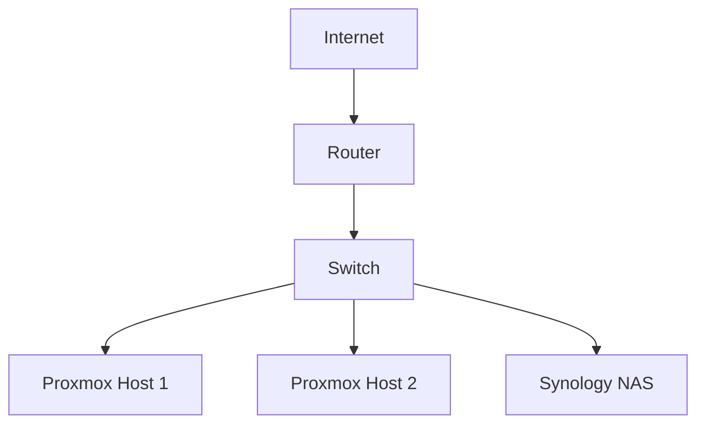
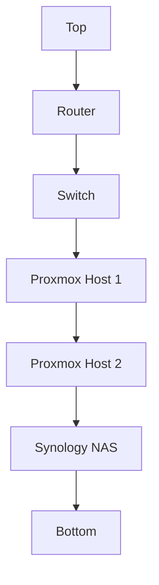

# 🖥️ Hardware Overview

This guide provides detailed information about the physical infrastructure of our homelab environment.

## 🖥️ Compute Resources

### Primary Virtualization Cluster

#### Proxmox Host 1 (pve1.ahmed2)
- **CPU**: [Specify CPU model and cores]
- **RAM**: [Specify RAM amount]
- **Storage**: [Specify storage configuration]
- **Network**: [Specify network configuration]

#### Proxmox Host 2 (ahmed2)
- **CPU**: [Specify CPU model and cores]
- **RAM**: [Specify RAM amount]
- **Storage**: [Specify storage configuration]
- **Network**: [Specify network configuration]

### Legacy Systems
- **HP Compaq 8200 Elite SFF**
  - **Purpose**: Backup and testing
  - **Specifications**: [Specify details]

## 🌐 Network Infrastructure

### Core Components
- **Router**: TP-Link Archer AX20
  - **Features**:
    - WiFi 6
    - Gigabit ports
    - QoS support
  - **Configuration**: [Specify details]

- **Switch**: Netgear GS108Ev4
  - **Features**:
    - 8 ports
    - VLAN support
    - PoE capability
  - **Configuration**: [Specify details]

### Network Layout


## 💾 Storage Solution

### Synology DS918+ NAS
- **Storage Capacity**: [Specify capacity]
- **RAID Configuration**: [Specify RAID setup]
- **Network**: [Specify network details]
- **Backup Configuration**: [Specify backup setup]

## 🏗️ Physical Infrastructure

### Rack Setup
- **Cabinet**: VEVOR 6U Wall Mount Cabinet
  - **Dimensions**: [Specify dimensions]
  - **Mounting**: [Specify mounting details]

### Current Layout


## 🔄 Future Hardware Plans

### Short-term Goals
1. [Specify planned upgrades]
2. [Specify planned additions]
3. [Specify planned modifications]

### Long-term Goals
1. [Specify future plans]
2. [Specify expansion plans]
3. [Specify upgrade paths]

## ⚡ Power Management

### Current Setup
- **UPS**: [Specify UPS details]
- **Power Distribution**: [Specify power setup]
- **Monitoring**: [Specify power monitoring]

### Planned Improvements
1. [Specify power improvements]
2. [Specify monitoring enhancements]
3. [Specify backup power plans]

## 🛠️ Maintenance

### Regular Tasks
1. **Hardware Inspection**
   ```bash
   # Check system health
   smartctl -a /dev/sda
   
   # Monitor temperatures
   sensors
   ```

2. **Network Verification**
   ```bash
   # Test network connectivity
   ping -c 4 8.8.8.8
   
   # Check network speed
   iperf3 -c iperf.he.net
   ```

3. **Storage Maintenance**
   ```bash
   # Check storage health
   zpool status
   
   # Verify backups
   rsync -av --dry-run /data /backup
   ```

### Backup Systems
1. **Local Backups**
   - [Specify local backup details]
   - [Specify backup schedule]
   - [Specify verification process]

2. **Remote Backups**
   - [Specify remote backup details]
   - [Specify backup schedule]
   - [Specify verification process]

## 📊 Performance Metrics

### System Performance
- **CPU Usage**: [Specify metrics]
- **Memory Usage**: [Specify metrics]
- **Storage I/O**: [Specify metrics]
- **Network Throughput**: [Specify metrics]

### Monitoring Tools
1. **Hardware Monitoring**
   ```bash
   # CPU monitoring
   top
   
   # Memory monitoring
   free -h
   
   # Disk monitoring
   iostat -x 1
   ```

2. **Network Monitoring**
   ```bash
   # Network usage
   iftop
   
   # Bandwidth monitoring
   nethogs
   ```

## 🔍 Troubleshooting

### Common Issues
1. **Hardware Problems**
   - [Specify common issues]
   - [Specify solutions]
   - [Specify prevention measures]

2. **Network Issues**
   - [Specify common issues]
   - [Specify solutions]
   - [Specify prevention measures]

3. **Storage Issues**
   - [Specify common issues]
   - [Specify solutions]
   - [Specify prevention measures]

## 📝 Documentation

### Hardware Documentation
- [Link to hardware manuals]
- [Link to configuration guides]
- [Link to maintenance procedures]

### Network Documentation
- [Link to network diagrams]
- [Link to configuration files]
- [Link to troubleshooting guides]

### Storage Documentation
- [Link to storage setup]
- [Link to backup procedures]
- [Link to recovery guides] 